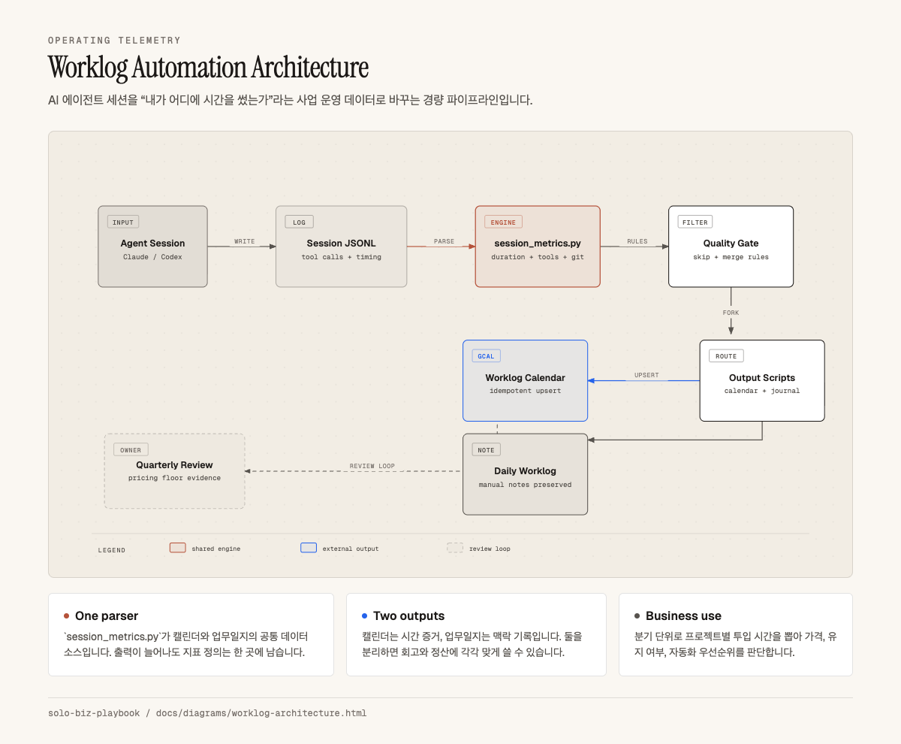
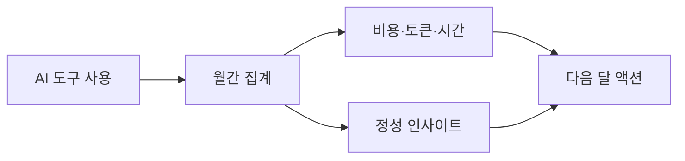

# Solo Biz Playbook

> **ggplab이 실제로 쓰는 1인팀 운영 플레이북**  
> 혼자 일하지만, 시스템은 팀처럼 굴리는 방법.

1인 사업자, 크리에이터, 사내 1인팀을 위한 전략·시간계측·AI 업무시스템 공개 노트입니다. ggplab이 실제 운영에서 쓰는 문서와 자동화를 공개 가능한 형태로 익명화해 정리했습니다.

---

## 왜 만들었나

혼자 일하면 전략, 실행, 기록, 자동화, 회고를 모두 직접 관리해야 합니다. 문제는 대부분의 자료가 “아이디어를 어떻게 검증할까”에만 머물고, 실제 운영에 필요한 계측과 자동화, AI 도구 사용 규칙까지 연결하지 않는다는 점입니다.

이 저장소는 그 공백을 메우기 위한 플레이북입니다. 린캔버스로 방향을 잡고, 워크로그로 시간을 계측하고, Claude/Codex 같은 AI 에이전트를 모델 비종속 구조로 운영하며, 구독형 AI 도구 사용량을 월간 단위로 복기합니다.

---

## 누구를 위한가

- 1인 사업자, 프리랜서, 크리에이터처럼 영업·제작·운영을 혼자 관리하는 사람
- 회사 안에서 데이터, 자동화, 교육, 콘텐츠, 운영 개선을 혼자 맡는 사내 1인팀
- AI 도구를 많이 쓰지만 결과물, 시간, 비용, 학습이 어디에 쌓이는지 추적하고 싶은 사람
- 개인의 노하우를 문서·템플릿·자동화로 누적하고 싶은 사람

## 무엇을 얻는가

- 내 사업이나 업무를 한 장으로 정리하는 전략 캔버스
- 프로젝트별 투입 시간을 남기는 워크로그 구조
- Claude/Codex 등 AI 에이전트를 바꿔도 유지되는 운영 규칙
- Claude 구독 요금제 사용량을 월간 단위로 복기하는 보고서 예시
- 공개 가능한 사례와 복사해서 쓸 수 있는 템플릿

---

## 구성

| 모듈 | 랜딩 페이지 | 쓰임 |
|---|---|---|
| **전략 설계** | [`docs/strategy-design/`](docs/strategy-design/) | 실제 사례와 빈 템플릿으로 자기 사업의 고객, 문제, 수익 구조를 정리 |
| **의사결정 원칙** | [`docs/principles/`](docs/principles/) | 시급 방어선, 플랫폼 집중도, 부의 사다리처럼 반복 판단에 쓰는 규율 |
| **운영 계측** | [`docs/operations-telemetry/`](docs/operations-telemetry/) | AI 에이전트 세션을 캘린더·업무일지로 남겨 프로젝트별 투입 시간을 실측 |
| **Claude Monthly Review** | [`docs/claude-monthly-review/`](docs/claude-monthly-review/) | Claude 구독 요금제 사용량을 매월 결제일 기준으로 자동 집계·복기 — 토큰·비용·카테고리·모델 분포로 다음 달 효율화 액션을 도출 |
| **에이전트 운영** | [`docs/agent-systems/`](docs/agent-systems/) | Claude, Codex 등 특정 모델에 종속되지 않는 공용 문서·스크립트·어댑터 구조 |

## 디렉토리 위계

| 계층 | 역할 |
|---|---|
| [`docs/`](docs/) | 원칙, 설명, 구조도 |
| [`examples/`](examples/) | 실제 사용 사례의 공개·익명화 버전 |
| [`template/`](template/) | 독자가 복사해서 채울 빈 양식 |
| [`automation/`](automation/) | 실행 가능한 자동화 예시와 스크립트 |

## 공유용 링크 맵

GitHub 메인 페이지는 전체 지도입니다. Threads나 블로그에서는 글의 주제에 맞는 디렉토리 README를 직접 링크하면 독자가 덜 헤맵니다.

| 공유 주제 | 바로 보낼 링크 |
|---|---|
| 전략 설계 | [`docs/strategy-design/`](docs/strategy-design/) |
| 1인 사업 운영 원칙 | [`docs/principles/`](docs/principles/) |
| 운영 계측 | [`docs/operations-telemetry/`](docs/operations-telemetry/) |
| Claude 구독 요금제 월간 사용 복기 | [`docs/claude-monthly-review/`](docs/claude-monthly-review/) |
| 에이전트 운영 체계 | [`docs/agent-systems/`](docs/agent-systems/) |
| 실제 사례만 보기 | [`examples/`](examples/) |
| 복사해서 쓰는 템플릿만 보기 | [`template/`](template/) |
| 실행 자동화만 보기 | [`automation/`](automation/) |

디렉토리별 README 작성 원칙은 [`docs/publishing-structure.md`](docs/publishing-structure.md)에 정리했습니다.

---

## 전략 설계


> 비용 구조·Profit First 분배·자산 로드맵 절대값 영역은 모자이크 처리됐습니다. 비중·전략·원칙·슬로건은 그대로입니다. 텍스트 상세: [`examples/my-canvas.md`](examples/my-canvas.md)

린캔버스는 스타터킷의 한 모듈입니다. 실제 사례로 감을 잡고, 빈 템플릿에 자기 사업을 투영한 뒤, 결과를 한 장 이미지로 시각화해 전략 드리프트를 점검합니다.

핵심 파일:

- [`docs/strategy-design/`](docs/strategy-design/) — 전략 설계 모듈 랜딩
- [`examples/my-canvas.md`](examples/my-canvas.md) — 실제로 채운 린캔버스
- [`template/lean-canvas.md`](template/lean-canvas.md) — 독자가 복사해 쓰는 빈 템플릿
- [`docs/principles/`](docs/principles/) — 캔버스에서 추출한 반복 의사결정 원칙

---

## 운영 계측

원칙은 실측 데이터가 있어야 방어됩니다. "시급 N원 밑으로 안 받는다"를 선언이 아니라 숫자로 말하려면, 프로젝트별 누적 시간을 자동으로 찍어주는 계측이 필요합니다.



- [`docs/operations-telemetry/`](docs/operations-telemetry/) — 운영 계측 모듈 랜딩
- [`automation/claude-worklog/`](automation/claude-worklog/) — Claude Code / Codex 세션이 끝날 때마다 Google 캘린더·Obsidian 업무일지에 자동 기록되는 Stop hook 시스템
- [운영 계측 구조도 HTML](docs/diagrams/worklog-architecture.html) — 세션 로그가 지표, 캘린더, 업무일지로 변환되는 흐름
- 분기 회고 때 프로젝트별 누적 시간을 필터링해서 [원칙 01(시급 방어선)](docs/principles/01-pricing-floor.md)의 실측 근거로 씁니다.

---

## Claude Monthly Review

Claude 유료 구독 요금제는 청구서만 봐서는 실제 사용 가치를 알기 어렵습니다. 월간 단위로 토큰, 비용, 세션, 시간, 프로젝트 분포를 집계하면 다음 달에 줄일 마찰과 유지할 고효율 사용 패턴이 보입니다.




- [`docs/claude-monthly-review/`](docs/claude-monthly-review/) — Claude Monthly Review 랜딩
- [`examples/monthly-claude-review/`](examples/monthly-claude-review/) — Claude 구독 요금제 월간 사용 복기 예시

---

## 에이전트 운영

AI 도구는 계속 바뀝니다. 업무 시스템을 특정 모델의 프롬프트 파일에만 넣으면, 모델이나 CLI를 바꿀 때마다 같은 자동화를 다시 만들어야 합니다.


- [`docs/agent-systems/`](docs/agent-systems/) — 모델 비종속 에이전트 운영 문서 묶음
- [`docs/agent-systems/agent-guide.md`](docs/agent-systems/agent-guide.md) — 공용 SSOT 문서와 얇은 에이전트별 어댑터 구조
- [`docs/agent-systems/utilities-registry.md`](docs/agent-systems/utilities-registry.md) — 재사용 스크립트·템플릿·스킬 레지스트리 템플릿
- [에이전트 운영 구조도 HTML](docs/diagrams/agent-system-architecture.html) — 공용 문서·스크립트와 모델별 어댑터의 관계

---

## 시작하기

1. [`template/lean-canvas.md`](template/lean-canvas.md)를 복사해 자기 사업의 현재 버전을 작성합니다.
2. [`docs/principles/`](docs/principles/)에서 자기 상황에 맞는 의사결정 기준을 고릅니다.
3. [`automation/claude-worklog/`](automation/claude-worklog/)를 참고해 프로젝트별 투입 시간 계측을 붙입니다.
4. [`docs/agent-systems/`](docs/agent-systems/)를 참고해 AI 에이전트 운영 지식을 특정 모델 밖으로 꺼냅니다.

---

## 린캔버스 시각화

텍스트 린캔버스는 정보 밀도는 높지만 **한눈에 안 들어옵니다**. 완성한 캔버스를 **한 장 이미지**로 만들어 두면:

- 매주 훑어보며 전략 드리프트를 감지하기 쉽다
- 미팅/피칭 때 첨부 자료로 바로 쓸 수 있다
- 동료·멘토에게 피드백 요청할 때 응답률이 높다

### 추천: Claude Code `diagram-design` 스킬

Claude Code에서:

```
/diagram-design
```

후 "내 린캔버스를 9블록 그리드 레이아웃으로 시각화해줘. 색상은 내 브랜드 톤에 맞춰서"라고 요청하면 **인라인 SVG HTML 파일** 한 장이 나옵니다. 편집도 텍스트로 가능합니다.

### 다른 옵션

| 도구 | 장점 | 단점 |
|---|---|---|
| **Notion 데이터베이스 보드** | 블록 편집·링크 연결 쉬움 | 이미지로 내보낼 때 레이아웃 깨짐 |
| **Excalidraw** | 손그림 톤, 자유로움 | Notion 미지원, 공유 시 별도 파일 |
| **Figma / Figjam** | 협업 피드백에 최적 | 1인 사업자에겐 과투자 |
| **공식 Lean Canvas** (leanstack.com) | 원저 양식 | 브랜딩 커스텀 어려움 |

> 개인 경험: Notion에 텍스트 SSOT + 분기마다 한 장짜리 PNG 내보내기 조합이 가장 유지비 낮았습니다.

---

## 누가 만들었나

**임정 / 지지플랩(GGPLab)** — AI × 데이터 × 교육 교차점에서 1인 사업 운영 중. 기업 강의 30회+, 멘토링 400명+ 누적.

- Threads: [@belle_epoque7](https://threads.net/@belle_epoque7)
- LinkedIn: [jayjunglim](https://linkedin.com/in/jayjunglim)
- Homepage: [ggplab.xyz](https://ggplab.xyz)
- 저서: 『n8n이 다해줌』(한빛미디어)

---

## 로드맵

스타터킷 사용 반응을 보고 단계적으로 확장합니다. 계획: [ROADMAP.md](ROADMAP.md)

다음 예정:
- **v1.1** — 원칙 실전 양식 (스크리닝 워크시트·계약 조항·이메일 템플릿·분기 회고 아젠다)
- **v1.2** — 실제 의사결정 로그(ADR) + 변경 이력
- **v1.3** — Profit First·KPI 추적 Google Sheets 연결

## 라이선스 / 기여

- 라이선스: [CC BY-SA 4.0](LICENSE) — 포크·리믹스 환영, 출처 명시·동일 조건 공유
- 기여: [CONTRIBUTING.md](CONTRIBUTING.md) — 자기 린캔버스 익명화 사례 PR 환영합니다. 한국 1인 사업자 캔버스 컬렉션으로 키우고 싶어요.
