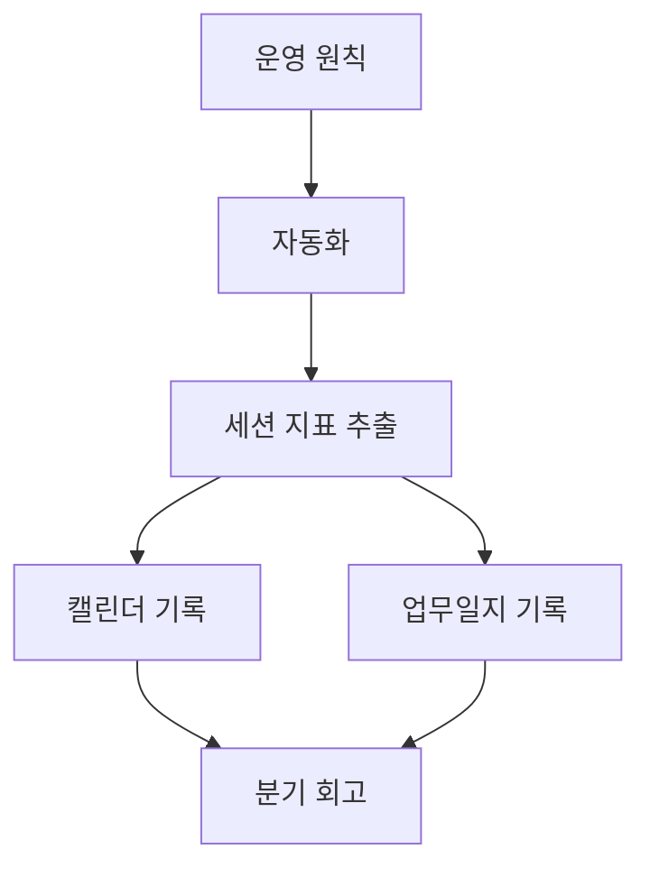

# Automation

> 1인 사업 운영을 계측하고 반복 작업을 줄이는 실행 예시 모음입니다.

`automation/`은 문서 원칙을 실제 실행으로 옮긴 구현 계층입니다. 특정 에이전트나 모델에만 묶이지 않도록, 재사용 가능한 로직은 스크립트로 두고 에이전트별 hook이나 설정은 얇은 어댑터로 관리합니다.

## 자동화 목록

| 자동화 | 위치 | 쓰임 |
|---|---|---|
| Claude Worklog | [`claude-worklog/`](claude-worklog/) | AI 에이전트 세션을 Google Calendar와 업무일지에 기록해 프로젝트별 투입 시간을 실측 |

## 관련 문서

- [`../docs/principles/01-pricing-floor.md`](../docs/principles/01-pricing-floor.md) — 실측 시간이 필요한 이유
- [`../docs/agent-systems/`](../docs/agent-systems/) — 자동화 로직을 모델 비종속으로 유지하는 기준
