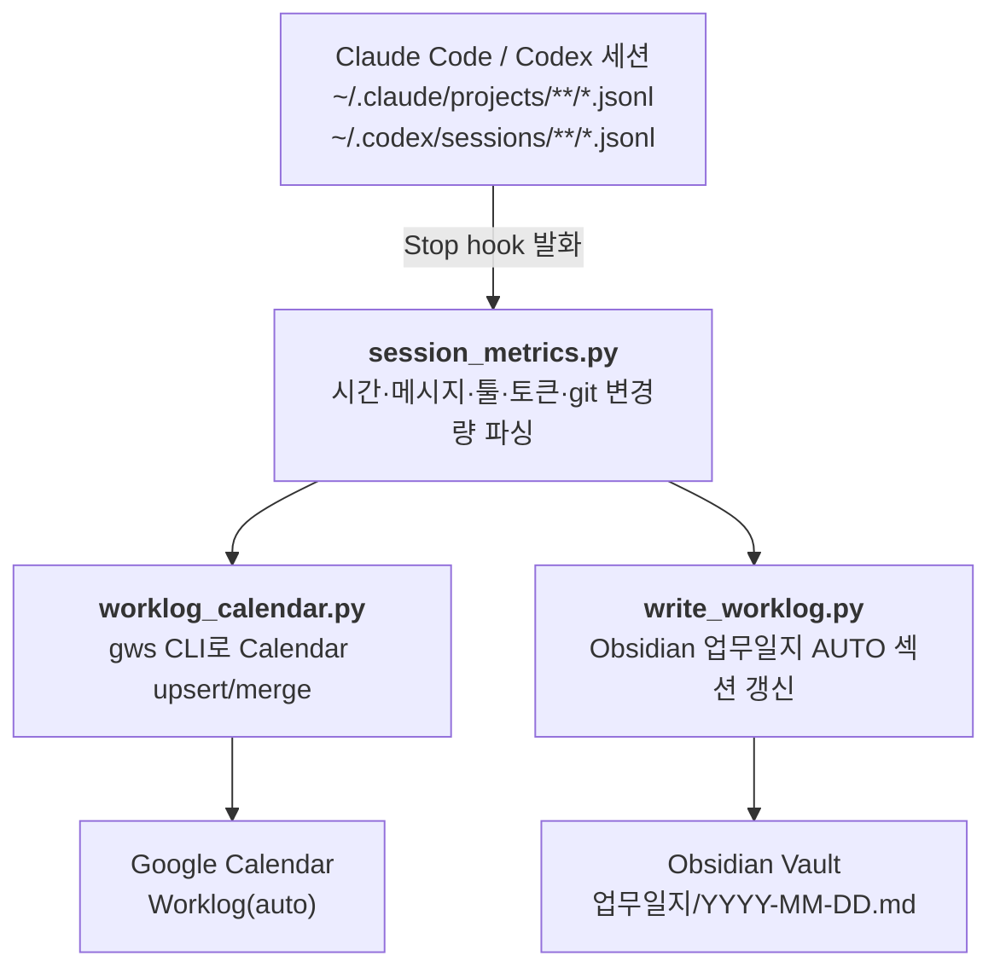

# Claude Worklog — 세션이 끝나면 자동으로 캘린더·업무일지에 꽂히는 시스템

> Claude Code / Codex 세션을 끝낼 때마다 **Google 캘린더에 "내가 한 작업" 이벤트가 자동으로 생기고**, 같은 내용이 Obsidian 업무일지에도 기록되는 개인 계측(self-telemetry) 시스템입니다. Stop hook 하나로 돌아갑니다. 전체 흐름은 아래 [데이터 흐름](#데이터-흐름) 섹션 참조.


---

## 왜 만들었나

1인 사업자에게 **"오늘 뭘 했지?"** 는 단순한 회고가 아니라 **단가 방어선 계산의 근거**입니다. 분기 회고 때 "이번 분기에 ggplab 멘토링에 몇 시간 썼나"를 추정이 아니라 데이터로 말할 수 있어야 시급을 방어할 수 있습니다.

근데 직접 기록하면 안 합니다. 그래서 **Claude Code가 이미 남기고 있는 세션 로그(`.jsonl`)** 를 Stop hook 시점에 파싱해서, 자동으로 캘린더·업무일지에 밀어넣도록 짰습니다.

---

## 뭐가 되나

**세션 종료 시점에 자동으로:**

1. 세션 `.jsonl`에서 정량 지표 추출 — 활성 시간, 메시지 수, 사용 툴, 토큰/비용, 커밋 수·라인 변화
2. Google 캘린더 `Worklog(auto)` 에 이벤트 upsert — `[프로젝트] Gemini가 지은 8~20자 한국어 제목`
3. Obsidian `업무일지/YYYY-MM-DD.md` 의 auto 섹션 갱신 — 같은 날 여러 세션이 시간순 합산

**Idempotent·머지 가능:**

- `session_id` 기반 upsert → 같은 세션을 두 번 돌려도 이벤트 중복 안 생김
- 같은 프로젝트의 30분 이내 인접 이벤트는 자동 머지 → 잠깐 세션 끊고 다시 붙여도 한 덩어리
- 짧은 throwaway(5분 미만 + 커밋 0 + 메시지 3개 미만)는 skip

**수동 백필 가능:**

```bash
# 최근 7일치 세션을 캘린더에 밀어넣기 (이미 있는 이벤트는 patch)
python3 scripts/worklog_calendar.py --backfill 7

# 특정 날짜 업무일지만 다시 만들기
python3 scripts/write_worklog.py --date 2026-04-24

# 이미 만든 캘린더 이벤트 제목만 Gemini로 재생성
python3 scripts/worklog_calendar.py --retitle --backfill 7
```

---

## 데이터 흐름



[운영 계측 구조도 HTML](../../docs/diagrams/worklog-architecture.html)도 함께 제공합니다.

---

## 구조

```
automation/claude-worklog/
├── README.md                     ← 이 파일
├── scripts/
│   ├── session_metrics.py        ← jsonl 파서·지표 집계 (캘린더/업무일지 양쪽 공통 데이터 소스)
│   ├── worklog_calendar.py       ← gws CLI로 Google Calendar upsert (머지·재제목 포함)
│   ├── write_worklog.py          ← Obsidian 업무일지 AUTO 섹션 생성·갱신
│   └── worklog_markers.py        ← <!-- AUTO:START --> 마커 round-trip 헬퍼 (수동 메모 보존)
└── hooks/
    └── settings.stop-hook.json   ← ~/.claude/settings.json 에 병합할 Stop hook 예시
```

### 각 스크립트가 하는 일

| 파일 | 역할 | 의존 |
|---|---|---|
| `session_metrics.py` | 세션 `.jsonl` → `{duration, msg_count, tool_counts, token_usage, git_changes, ...}` | `git` CLI |
| `worklog_calendar.py` | 지표 → 캘린더 이벤트 body. `extendedProperties.private.claude_session_id` 로 idempotent upsert. 같은 프로젝트 30분 이내 이벤트는 머지. `WORKLOG_USE_GEMINI=1` 이면 Gemini로 제목 생성. | `gws` CLI, `GEMINI_API_KEY` (옵션) |
| `write_worklog.py` | 그날 모든 세션 → Obsidian `업무일지/{date}.md` AUTO 섹션. Gemini로 narrative 요약. 수동 메모는 보존. | `GEMINI_API_KEY` (옵션), Obsidian vault 경로 |
| `worklog_markers.py` | `<!-- AUTO:START --> ~ <!-- AUTO:END -->` 사이만 갈아끼우는 round-trip 유틸 | — |

---

## 설치하기

### 준비물

- **Claude Code** (Stop hook 지원하는 최신 버전)
- **Python 3.11+**
- **`git` CLI** — 커밋 수·라인 변화 계산용
- **`jq`** — Stop hook payload에서 `session_id` 뽑을 때 사용 (`brew install jq`)
- **`gws` (Google Workspace CLI)** — 캘린더 upsert에 사용
  - 설치 방식은 `gws` 문서 참조. 본인은 `npm -g @google/google-workspace-cli` 계열 바이너리 사용 중
  - 최초 OAuth 인증 1회 필요 (`gws auth login`)
- **Google 캘린더 1개** — `Worklog(auto)` 같은 이름으로 새로 만드는 것 추천
- **(옵션) Obsidian vault** — 업무일지 자동화 원할 때만
- **(옵션) Gemini API 키** — 제목 / narrative 자동 생성 원할 때만

### 1. 클론 & 디렉토리 확인

```bash
git clone https://github.com/ggplab/solo-biz-playbook.git
cd solo-biz-playbook/automation/claude-worklog
```

### 2. Google 캘린더 만들고 ID 복사

- Google Calendar → 캘린더 추가 → 이름 `Worklog(auto)` (색상은 취향대로)
- 설정 → 해당 캘린더 → **캘린더 ID** 복사 (형식: `xxxxxxxx@group.calendar.google.com`)

### 3. 환경 변수 설정 (`~/.zshenv` 나 프로젝트 `.env`)

```bash
# 필수
export WORKLOG_CALENDAR_ID="xxxxxxxx@group.calendar.google.com"

# headless (launchd/cron)에서도 돌게 하려면 권장
export GOOGLE_WORKSPACE_CLI_KEYRING_BACKEND="file"

# 옵션 — Gemini로 이벤트 제목·업무일지 narrative 생성
export GEMINI_API_KEY="..."
export WORKLOG_USE_GEMINI=1

# 옵션 — Obsidian vault 경로 (자동 탐지 실패 시에만)
export OBSIDIAN_VAULT_PATH="$HOME/Documents/Obsidian Vault"
```

### 4. 프로젝트별 색상 매핑 (옵션)

`scripts/worklog_calendar.py` 의 `PROJECT_COLOR` dict를 본인 프로젝트 이름에 맞게 수정하세요. 프로젝트 디렉토리 이름(`~/Projects/xxx`)이 키가 됩니다.

```python
PROJECT_COLOR = {
    "my-consulting": "10",   # basil
    "my-saas":       "6",    # tangerine
    "side-blog":     "3",    # grape
}
```

색상 코드는 [Google Calendar colorId](https://developers.google.com/calendar/api/v3/reference/colors) 참고.

### 5. Claude Code Stop hook 등록

`~/.claude/settings.json` 의 `hooks.Stop` 에 [hooks/settings.stop-hook.json](hooks/settings.stop-hook.json) 내용을 **병합**하세요 (전체 덮어쓰기 금지). 경로는 본인이 클론한 위치로 바꿔야 합니다.

병합 예시:

```json
{
  "hooks": {
    "Stop": [
      {
        "hooks": [
          {
            "type": "command",
            "command": "zsh -c 'source ~/.zshenv 2>/dev/null; PAYLOAD=$(cat); SID=$(printf %s \"$PAYLOAD\" | jq -r \".session_id // empty\"); [ -n \"$SID\" ] && python3 $HOME/Projects/solo-biz-playbook/automation/claude-worklog/scripts/worklog_calendar.py --session-id \"$SID\" >> /tmp/worklog-calendar.log 2>&1 || true'",
            "timeout": 30,
            "async": true
          }
        ]
      }
    ]
  }
}
```

### 6. 첫 실행 — 최근 7일치 백필로 동작 검증

```bash
cd automation/claude-worklog

# dry-run 먼저
python3 scripts/worklog_calendar.py --backfill 7 --dry-run

# 실제 upsert
python3 scripts/worklog_calendar.py --backfill 7
```

Google Calendar `Worklog(auto)` 에 이벤트가 꽂혔는지 확인 후, Claude Code 세션을 하나 열었다 닫으면 Stop hook이 자동으로 새 이벤트를 추가합니다.

---

## 자주 쓰는 명령

```bash
# 오늘 전체 세션 재동기화
python3 scripts/worklog_calendar.py

# 특정 세션만 (session_id 는 ~/.claude/projects/... 경로에서 확인)
python3 scripts/worklog_calendar.py --session-id <UUID>

# 이벤트 제목을 Gemini로 다시 생성 (기존 이벤트 유지하고 summary만 덮음)
python3 scripts/worklog_calendar.py --retitle --date 2026-04-20
python3 scripts/worklog_calendar.py --retitle --backfill 7

# 업무일지만 재생성 (캘린더 건드리지 않음)
python3 scripts/write_worklog.py --date 2026-04-24
python3 scripts/write_worklog.py --backfill 7

# 기존 이벤트가 있을 때만 patch (새 이벤트는 생성 안 함) — 과거 데이터 정비용
python3 scripts/worklog_calendar.py --backfill 30 --existing-only
```

---

## 커스터마이즈 포인트

- **캘린더 이벤트 제목 규칙** — `worklog_calendar.py` 의 `_gemini_title()` 프롬프트 수정
- **skip 기준** — `MIN_DURATION_SEC`, `MIN_MSG_FALLBACK` 상수 (기본: 5분 미만 + 메시지 3개 미만 + 커밋 0)
- **머지 윈도** — `MERGE_GAP_SEC` 상수 (기본 30분)
- **업무일지 narrative 프롬프트** — `write_worklog.py` 의 Gemini 호출부
- **캘린더 대신 다른 도구에 넣기** — `worklog_calendar.py` 의 `_gws()` 함수만 Notion/ClickUp/TickTick API로 갈아끼우면 됩니다. 지표 추출은 `session_metrics.py` 가 이미 분리돼 있어요.

---

## 한계·주의

- **`gws` CLI 의존** — Google OAuth를 직접 붙이고 싶으면 `_gws()` 를 `google-api-python-client` 로 교체해야 합니다
- **Codex 세션 지원은 경로만 추가한 수준** — `~/.codex/sessions/**/*.jsonl` 을 읽지만, Claude Code 포맷과 완전 동일하진 않아서 일부 지표가 비어있을 수 있습니다
- **Gemini 2.5 Flash는 thinking이 기본 ON** — 짧은 응답을 받으려면 `generationConfig.thinkingConfig.thinkingBudget=0` 을 반드시 명시 (현재 코드엔 들어있음). 끄지 않으면 `maxOutputTokens` 대부분이 thinking에 소비돼 `parts` 가 비어 응답 파싱이 실패합니다
- **`extendedProperties.private.claude_session_id`** 를 키로 쓰기 때문에, 같은 세션 ID를 공유하는 다른 캘린더 이벤트가 있으면 꼬일 수 있습니다 (현실적으로 충돌 확률 0)

---

## 왜 이 구조인가 — 설계 노트

- **지표 추출과 출력부 분리** (`session_metrics.py` vs `worklog_calendar.py` / `write_worklog.py`) — 캘린더·업무일지가 같은 숫자를 봐야 나중에 KPI 대시보드 붙일 때 헷갈리지 않습니다
- **마커 기반 round-trip** (`worklog_markers.py`) — 자동화가 수동 메모를 덮지 않도록. 업무일지에 내가 추가 코멘트를 달아도 다음 hook 실행에 살아남습니다
- **idempotent upsert** — Stop hook은 같은 세션에 대해 여러 번 호출될 수 있습니다 (세션 재개 등). `session_id` 를 외부 키로 써서 upsert 의미론을 유지
- **짧은 세션 skip** — 5분짜리 "디렉토리 확인" 같은 throwaway가 캘린더를 덮지 않도록. 커밋이나 대화량이 있으면 예외적으로 기록
- **Gemini 제목은 신규 생성시에만** — 머지·재동기화 때마다 호출하면 제목이 계속 흔들리고 비용도 늘어납니다. `--retitle` 플래그로 명시할 때만 재생성

---

## 관련 원칙

이 자동화는 `docs/principles/01-pricing-floor.md` (시급 방어선) 의 **실측 인프라**입니다. 실시간 계측이 없으면 "나는 시급 N원 밑으로는 안 받는다" 는 선언이 희망사항이 됩니다. 분기마다 캘린더 필터로 프로젝트별 누적 시간을 뽑아 단가 재협상 근거로 씁니다.
