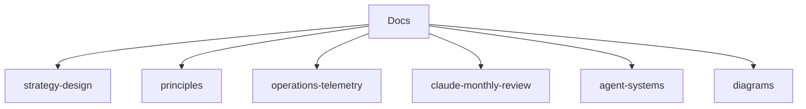

# Docs

> 1인 사업 운영 원칙과 AI 에이전트 운영 방법을 설명하는 문서 묶음입니다.

`docs/`는 실행 파일이나 사례가 아니라 "왜 이렇게 운영하는가"와 "어떤 기준으로 판단하는가"를 정리하는 계층입니다. 실제 사례는 [`../examples/`](../examples/)에, 복사용 양식은 [`../template/`](../template/)에, 실행 자동화는 [`../automation/`](../automation/)에 둡니다.

## 문서 목록

| 문서 묶음 | 위치 | 쓰임 |
|---|---|---|
| 전략 설계 | [`strategy-design/`](strategy-design/) | 린캔버스 사례와 템플릿을 연결해 사업 가설을 정리 |
| 운영 원칙 | [`principles/`](principles/) | 가격, 플랫폼 의존도, 자산화 여부처럼 반복 판단에 쓰는 기준 |
| 운영 계측 | [`operations-telemetry/`](operations-telemetry/) | AI 에이전트 세션을 캘린더·업무일지로 남기는 시간 회계 구조 |
| Claude Monthly Review | [`claude-monthly-review/`](claude-monthly-review/) | 정액제 AI 도구 사용량을 월간 단위로 복기하는 공개 사례 |
| 에이전트 운영 | [`agent-systems/`](agent-systems/) | Claude, Codex 등 특정 모델에 종속되지 않는 공용 문서·스크립트·어댑터 구조 |
| 구조도 | [`diagrams/`](diagrams/) | README와 상세 문서에서 재사용하는 PNG/HTML 다이어그램 |
| 공개 안전 규칙 | [`publication-safety.md`](publication-safety.md) | 브랜딩에 도움이 되는 공개 정보와 비식별화해야 할 정보를 구분하는 기준 |
| 참고 자료 | [`references.md`](references.md) | 저장소 내용을 뒷받침하는 외부 참고 링크 |

## 위계 규칙

- `docs/`에는 설명, 원칙, 구조도를 둡니다.
- 실제로 채운 공개 사례는 `examples/`에 둡니다.
- 독자가 복사해서 채울 양식은 `template/`에 둡니다.
- 실행 가능한 자동화 예시는 `automation/`에 둡니다.
