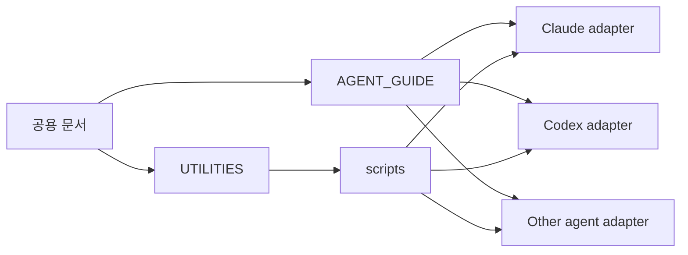

# Model-Neutral Agent Systems

> Claude, Codex 등 특정 모델에 종속되지 않는 공용 문서·스크립트·어댑터 구조를 설명하는 문서 묶음입니다.

AI 도구는 계속 바뀝니다. 업무 시스템을 특정 모델의 프롬프트 파일에만 넣으면, 모델이나 CLI를 바꿀 때마다 같은 자동화를 다시 만들어야 합니다. 이 모듈은 그 비용을 0에 수렴시키기 위한 4계층 구조를 제시합니다.

## 모델 비종속 어댑터 구조 한눈에

| 계층 | 역할 | 위치 예시 | 어떤 내용을 담는가 |
|---|---|---|---|
| 1. 공용 SSOT 문서 | 모든 에이전트가 첫 5분에 읽는 환경·운영 지도 | `AGENT_GUIDE.md`, `UTILITIES.md` | 환경 변수 정책, 도구 맵, 프로젝트 레지스트리, retry budget 같은 운영 규칙 |
| 2. 모델별 얇은 어댑터 | 각 에이전트의 자동 로드 파일이 SSOT를 가리키는 포인터 역할만 함 | `adapters/<agent>/AGENTS.md`, `CLAUDE.md` | "먼저 AGENT_GUIDE를 읽고 따르라" 정도의 트리거 규칙만 |
| 3. 재사용 스크립트 | 실제 비즈니스 로직이 들어가는 실행 가능한 엔진 | `scripts/*.py`, `scripts/*.mjs` | 이메일 초안, 워크로그 적재, PDF 변환 같은 도메인 로직, 어떤 에이전트가 호출해도 동일 결과 |
| 4. 스킬 레지스트리 | 새 기능을 만들기 전에 검색하는 인덱스 | `UTILITIES.md` | 유틸리티 이름·타입·위치·목적·어댑터 매핑 한 줄씩 |

핵심 원칙은 단순합니다. 업무 로직은 특정 모델의 프롬프트 파일에 넣지 말고, 공용 문서와 실행 가능한 스크립트에 둡니다. 모델별 파일은 그 공용 자산을 가리키는 포인터로만 유지합니다. 이 구조를 따르면 새 모델이나 새 CLI가 등장해도 어댑터 한 줄만 추가하면 전체 자동화가 그대로 작동합니다.

## 핵심 파일

| Document | Purpose |
|---|---|
| [`agent-guide.md`](agent-guide.md) | 워크스페이스 운영 규칙, 비식별화 기준, 에이전트별 얇은 어댑터 구조 |
| [`utilities-registry.md`](utilities-registry.md) | 재사용 스크립트·템플릿·스킬을 한 곳에서 관리하는 레지스트리 템플릿 |
| [에이전트 운영 구조도 HTML](../diagrams/agent-system-architecture.html) | 공용 문서·스크립트와 모델별 어댑터의 관계 인터랙티브 버전 |

## 읽는 순서

1. 위 4계층 표로 전체 구조의 형태를 잡습니다.
2. [`agent-guide.md`](agent-guide.md)에서 에이전트가 읽어야 할 공용 운영 지도 작성 패턴을 봅니다.
3. [`utilities-registry.md`](utilities-registry.md)에서 새 스크립트를 만들기 전에 검색할 레지스트리 양식을 확인합니다.
4. 자기 워크스페이스에 4계층 디렉토리를 만들고, 기존 자동화 중 모델 종속된 것을 공용 스크립트로 옮깁니다.
5. [`../diagrams/agent-system-architecture.html`](../diagrams/agent-system-architecture.html)을 슬라이드나 문서에 재사용합니다.

## 공개 원칙

- 특정 모델을 필수 조건으로 쓰지 않습니다.
- 업무 규칙은 모델별 설정 파일이 아니라 공용 문서에 둡니다.
- 실행 로직은 프롬프트가 아니라 스크립트나 템플릿으로 분리합니다.
- API 키, 캘린더 ID, 고객명, 로컬 절대경로는 플레이스홀더로 표현합니다.

## 다음 행동

4계층 구조가 자리잡으면 [`../operations-telemetry/`](../operations-telemetry/)와 [`../claude-monthly-review/`](../claude-monthly-review/)의 계측 스크립트를 그 위에 얹습니다. 어떤 모델이 세션을 돌리든 같은 스크립트가 캘린더·업무일지에 같은 형식으로 기록을 남기므로, 모델 교체 비용이 어댑터 수정 한 줄로 끝납니다.
