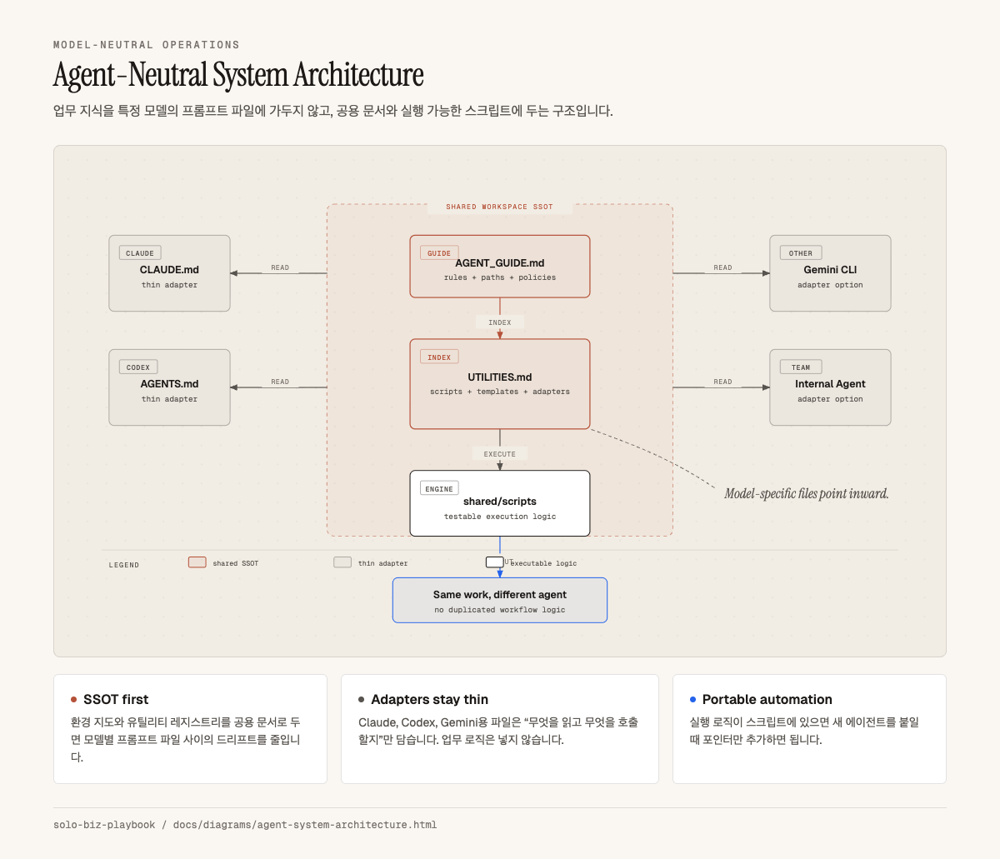
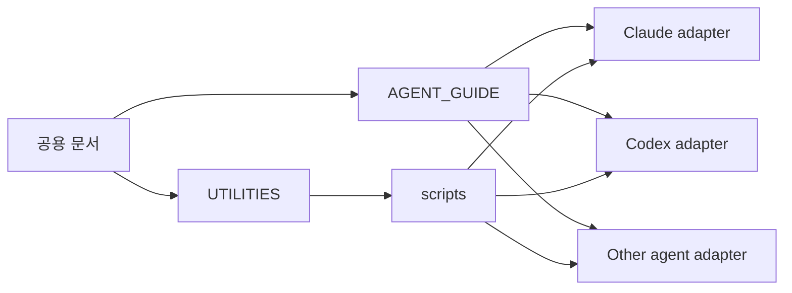

# Model-Neutral Agent Systems

> Claude, Codex 등 특정 모델에 종속되지 않는 공용 문서·스크립트·어댑터 구조를 설명하는 문서 묶음입니다.

AI 도구는 계속 바뀝니다. 업무 시스템을 특정 모델의 프롬프트 파일에만 넣으면, 모델이나 CLI를 바꿀 때마다 같은 자동화를 다시 만들어야 합니다.

| Document | Purpose |
|---|---|
| [`agent-guide.md`](agent-guide.md) | 워크스페이스 운영 규칙, 비식별화 기준, 에이전트별 얇은 어댑터 구조 |
| [`utilities-registry.md`](utilities-registry.md) | 재사용 스크립트·템플릿·스킬을 한 곳에서 관리하는 레지스트리 템플릿 |
| [에이전트 운영 구조도 HTML](../diagrams/agent-system-architecture.html) | 공용 문서·스크립트와 모델별 어댑터의 관계 |

핵심 원칙은 단순합니다. 업무 로직은 특정 모델의 프롬프트 파일에 넣지 말고, 공용 문서와 실행 가능한 스크립트에 둡니다. Claude, Codex, Gemini CLI 같은 도구별 파일은 그 공용 자산을 가리키는 포인터로만 유지합니다.

## 읽는 순서

1. [`agent-guide.md`](agent-guide.md) — 에이전트가 읽어야 할 공용 운영 지도
2. [`utilities-registry.md`](utilities-registry.md) — 새 스크립트를 만들기 전에 검색할 레지스트리
3. [`../diagrams/agent-system-architecture.html`](../diagrams/agent-system-architecture.html) — 구조를 슬라이드나 문서에 넣고 싶을 때 쓰는 HTML 버전

## 공개 원칙

- 특정 모델을 필수 조건으로 쓰지 않습니다.
- 업무 규칙은 모델별 설정 파일이 아니라 공용 문서에 둡니다.
- 실행 로직은 프롬프트가 아니라 스크립트나 템플릿으로 분리합니다.
- API 키, 캘린더 ID, 고객명, 로컬 절대경로는 플레이스홀더로 표현합니다.
