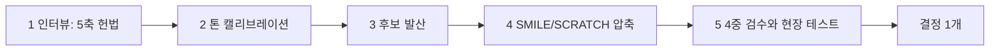

# Brand Naming

> 1인 사업자와 크리에이터가 자기 브랜드·상호명을 결정할 때 후보를 만들기 전에 의사결정 기준부터 잡는 모듈입니다.

브랜드 네이밍은 보통 "예쁜 이름 찾기"부터 시작하지만, 그 순서로는 후보가 산만해지고 결정이 미뤄집니다. 이 모듈은 후보 생성보다 먼저 의사결정 헌법과 톤 시그니처를 잠그고, 그 다음에 공식적으로 발산·압축·검수로 넘어가는 5단계 프로세스를 제공합니다.

## 핵심 파일

| 항목 | 위치 | 쓰임 |
|---|---|---|
| 프로세스 | [`process.md`](process.md) | 인터뷰부터 검수까지 5단계 추상 절차 |
| 권위 레퍼런스 | [`references.md`](references.md) | Igor, SMILE·SCRATCH, Lexicon, StoryBrand 요약과 사용 단계 매핑 |
| 빈 양식 | [`../../template/brand-naming-brief.md`](../../template/brand-naming-brief.md) | 5축 헌법과 톤 시그니처를 채워 넣는 작업 시트 |

## 읽는 순서

1. [`process.md`](process.md)로 5단계의 전체 흐름과 각 단계의 산출물을 봅니다.
2. [`references.md`](references.md)에서 각 단계에 쓸 권위 자료를 골라 둡니다.
3. [`../../template/brand-naming-brief.md`](../../template/brand-naming-brief.md)을 복사해 자기 헌법과 톤 시그니처를 채웁니다.
4. 채운 시트를 기준으로 후보 발산·압축·검수를 진행합니다.

## 공개 원칙

- 절차는 모델·도구 비종속으로 기술합니다. 특정 AI에 의존하는 단계 금지.
- 작성자의 실명, 고객사명, 구체 매출 수치는 본문에 노출하지 않습니다.
- 검수 단계의 등록·상표·도메인 확인은 각 국가 공식 시스템을 1차 소스로 사용합니다.

## 다음 행동

지금 새 브랜드를 결정해야 한다면 [`../../template/brand-naming-brief.md`](../../template/brand-naming-brief.md)를 복사해 빈칸부터 채워 보세요. 후보 단어보다 5축 헌법을 먼저 닫는 것이 이 모듈의 핵심입니다.
