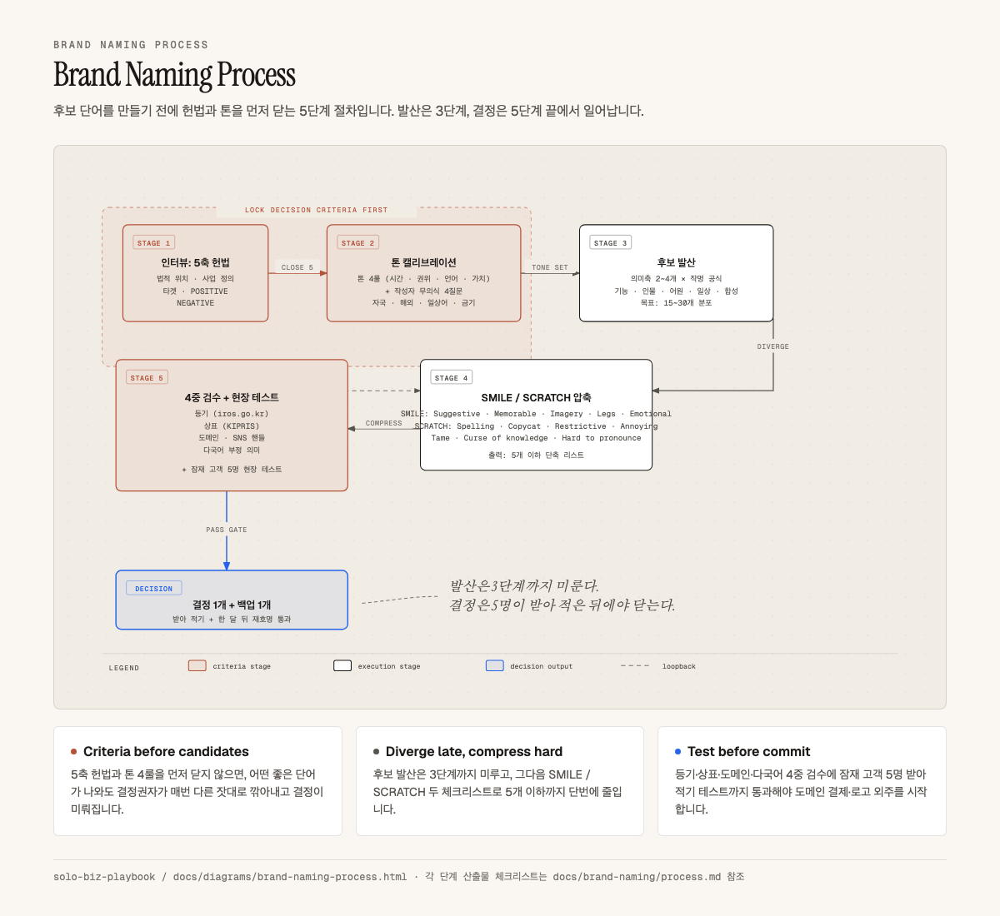

# Brand Naming

> 1인 사업자와 크리에이터가 자기 브랜드·상호명을 결정할 때 후보를 만들기 전에 의사결정 기준부터 잡는 모듈입니다.

브랜드 네이밍은 보통 "예쁜 이름 찾기"부터 시작하지만, 그 순서로는 후보가 산만해지고 결정이 미뤄집니다. 이 모듈은 후보 생성보다 먼저 의사결정 헌법과 톤 시그니처를 잠그고, 그 다음에 발산·압축·검수로 넘어가는 5단계 프로세스를 제공합니다.

> 시각 자료 인터랙티브 버전: [`../diagrams/brand-naming-process.html`](../diagrams/brand-naming-process.html)

## 5단계 한눈에

| 단계 | 핵심 | 산출물 |
|---|---|---|
| 1. 인터뷰: 5축 헌법 | 법적 위치·사업 정의·타겟·정체성 POSITIVE·정체성 NEGATIVE | 종이 한 장에 5축이 닫힘 |
| 2. 톤 캘리브레이션 | 톤 4룰 + 작성자 무의식 단어 4질문 | 후보 발산 좌표가 잡힘 |
| 3. 후보 발산 | 의미축 2~4개 × 작명 공식 | 후보 15~30개 |
| 4. SMILE / SCRATCH 압축 | Watkins 두 체크리스트 | 후보 5개 이하 |
| 5. 4중 검수 + 현장 테스트 | 등기·상표·도메인·다국어 / 잠재 고객 5명 발음·연상 | 최종 후보 1개 + 백업 1개 |

핵심 원칙은 "발산은 3단계까지 미루고, 결정은 5단계 끝에서 일어난다" 하나입니다. 헌법과 톤이 닫히지 않은 상태에서 후보를 뽑으면 평가 기준이 매번 흔들립니다.

## 핵심 파일

| 항목 | 위치 | 쓰임 |
|---|---|---|
| 프로세스 본문 | [`process.md`](process.md) | 5단계 절차의 상세 실행 가이드 |
| 권위 레퍼런스 | [`references.md`](references.md) | Igor, SMILE·SCRATCH, Lexicon, StoryBrand 요약과 사용 단계 매핑 |
| 빈 양식 | [`../../template/brand-naming-brief.md`](../../template/brand-naming-brief.md) | 5축 헌법과 톤 시그니처를 채워 넣는 작업 시트 |
| 다이어그램 | [`../diagrams/brand-naming-process.html`](../diagrams/brand-naming-process.html) | 5단계 흐름 인터랙티브 버전 |

## 읽는 순서

1. 위 5단계 표와 다이어그램으로 전체 흐름의 형태를 잡습니다.
2. [`process.md`](process.md)에서 각 단계의 산출물과 실행 디테일을 확인합니다.
3. [`references.md`](references.md)에서 각 단계에 쓸 권위 자료를 골라 둡니다.
4. [`../../template/brand-naming-brief.md`](../../template/brand-naming-brief.md)을 복사해 자기 헌법과 톤 시그니처를 채웁니다.
5. 채운 시트를 기준으로 후보 발산·압축·검수를 진행합니다.

## 공개 원칙

- 절차는 모델·도구 비종속으로 기술합니다. 특정 AI에 의존하는 단계 금지.
- 작성자의 실명, 고객사명, 구체 매출 수치는 본문에 노출하지 않습니다.
- 검수 단계의 등록·상표·도메인 확인은 각 국가 공식 시스템을 1차 소스로 사용합니다.

## 다음 행동

지금 새 브랜드를 결정해야 한다면 [`../../template/brand-naming-brief.md`](../../template/brand-naming-brief.md)를 복사해 빈칸부터 채워 보세요. 후보 단어보다 5축 헌법을 먼저 닫는 것이 이 모듈의 핵심입니다.

이미 사업 가설이 정리돼 있다면 [`../strategy-design/`](../strategy-design/) 의 린캔버스 모듈과 묶어서 봅니다. 브랜드 이름이 캔버스의 UVP(고유가치제안)와 정합하는지 확인할 수 있습니다.
