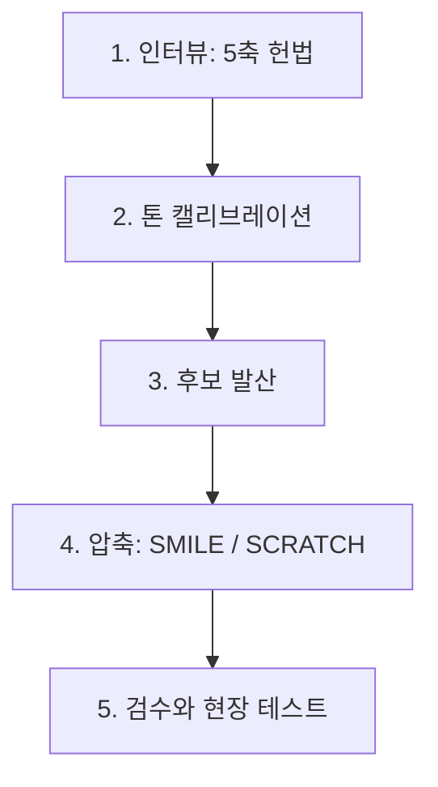

# Brand Naming Process

> 후보 단어를 만들기 전에 의사결정 기준부터 닫는 5단계 절차입니다.

대부분의 네이밍 실패는 후보를 너무 일찍 만들기 때문에 발생합니다. 헌법과 톤이 정해지지 않은 상태에서 단어를 뽑으면, 결정권자가 매번 다른 기준으로 후보를 깎아내고 결정 자체가 미뤄집니다. 이 절차는 발산을 3단계로 미루고, 그 앞에 의사결정 기준을 명문화하는 두 단계를 둡니다.

---

## 1단계. 인터뷰: 5축 의사결정 헌법

후보를 만들기 전에 다음 다섯 축을 종이 한 장에 못 박습니다. 이 축이 비어 있으면 어떤 좋은 이름이 나와도 결정이 흔들립니다.

| 축 | 결정해야 할 질문 |
|---|---|
| 법적 위치 | 기존 법인·브랜드와 어떤 관계인가 (별도 사업자 / 법인명 교체 / 산하 서브브랜드 / 개인 사업자 추가) |
| 사업 정의 | 무엇을 파는가 (B2B 서비스 / B2C 교육 / SaaS·제품 / 출판·콘텐츠 / 기타) |
| 타겟·결제권자 | 가장 큰 단일 고객은 누구이며, 의사결정자의 직책은 무엇인가 |
| 정체성 POSITIVE | 무엇으로 기억되고 싶은가. 한 단어 또는 한 문장 |
| 정체성 NEGATIVE | 절대 하지 않을 일은 무엇인가 |

NEGATIVE 축이 POSITIVE보다 정체성을 더 정확하게 드러내는 경우가 많습니다. "이것만은 안 한다"가 후보 단어의 절반을 자동으로 제거합니다.

---

## 2단계. 톤 캘리브레이션

5축이 닫혔으면, 이름의 형식을 결정하는 톤 시그니처 4룰을 잡습니다.

| 룰 | 결정 질문 |
|---|---|
| 시간 톤 | 5년 뒤에도 부끄럽지 않은 단어인가. 트렌드 단어는 자동 탈락 |
| 권위 톤 | 위에서 가르치는 톤인가, 옆에서 함께 가는 톤인가 |
| 언어 선택 | 한국어 / 영어 / 라틴어·고전 어원 / 사람 이름 가운데 타겟이 회의실에서 자연스럽게 호명할 언어는 |
| 가치관 함축 | 코어 가치가 의미적으로 묻어나는가 |

그다음 작성자 본인에게 다음 4질문을 던집니다. 이 답이 가장 정확한 후보 발산 좌표가 됩니다.

1. 톤이 좋다고 느끼는 자국 브랜드 1~3개
2. 톤이 좋다고 느끼는 해외 브랜드 1~3개
3. 평소 좋아하는 일상 단어 1~3개 (브랜드가 아닌 그냥 단어)
4. 절대 피하고 싶은 단어·접미사

답에 반복되는 음절·어감·문화권을 메모해 두면, 발산 단계에서 후보의 공통 좌표가 됩니다.

---

## 3단계. 후보 발산

헌법과 톤이 잠긴 다음에야 후보를 만듭니다. 의미축 2~4개를 정하고, 각 축마다 작명 공식을 적용해 15~30개를 한 번에 뽑습니다.

작명 공식 예시:
- 기능 직시: 파는 것을 그대로 묘사하는 일반어 (마켓컬리, 당근, 직방 계열)
- 사람 이름·인물 인용: 창업자명 또는 역사적 인물
- 라틴·고전 어원: 가치관 키워드의 어원 또는 합성
- 일상 단어 차용: 2단계 4번 질문에서 나온 단어를 그대로 채택
- 신조어·합성: 두 단어를 자르고 붙이는 portmanteau

이 단계의 목표는 "좋은 이름"이 아니라 충분한 분포입니다. 평가는 다음 단계에서 합니다.

---

## 4단계. 압축: SMILE / SCRATCH

후보 15~30개를 다음 두 체크리스트로 5개 이하로 줄입니다. 출처는 Alexandra Watkins, *Hello, My Name is Awesome*.

| SMILE: 통과해야 좋은 이름 | SCRATCH: 하나라도 걸리면 탈락 |
|---|---|
| **S**uggestive: 핵심 가치를 환기 | **S**pelling: 발음대로 적기 어렵다 |
| **M**emorable: 익숙한 것과 연결돼 기억에 남는다 | **C**opycat: 경쟁자와 헷갈린다 |
| **I**magery: 머릿속에 그림이 떠오른다 | **R**estrictive: 사업 확장을 제한한다 |
| **L**egs: 광고·콘텐츠로 확장 가능 | **A**nnoying: 농담·억지 약어 |
| **E**motional: 감정 연결 | **T**ame: 너무 평범해 기억에 안 남음 |
| | **C**urse of knowledge: 내부자만 안다 |
| | **H**ard to pronounce: 입에 잘 안 붙는다 |

5개 이하로 좁힌 다음, 각각에 대해 5축 헌법·톤 시그니처와 충돌이 없는지 다시 한 번 표로 대조합니다.

---

## 5단계. 검수와 현장 테스트

남은 후보를 다음 네 가지로 검수합니다.

| 검수 항목 | 확인 위치 (한국 기준) |
|---|---|
| 등기 동일 상호 | 대법원 인터넷등기소 (iros.go.kr) |
| 상표 등록 | 특허정보검색서비스 KIPRIS (kipris.or.kr) |
| 도메인·SNS 핸들 | `.com / .co.kr / .xyz` 와 Threads / Instagram / X / LinkedIn 핸들을 동시에 확보 가능한지 |
| 다국어 부정 의미 | 주요 진출 후보 언어권에서 부정 의미·욕설로 읽히는지 |

네 항목을 모두 통과한 1~2개 후보로 현장 테스트를 합니다. 잠재 고객 5명에게 다음을 묻습니다.

1. 처음 들었을 때 받아 적을 수 있는가
2. 어떤 사업으로 들리는가
3. 한 달 뒤에 다시 떠올릴 수 있는가

받아 적기와 한 달 뒤 재호명이 동시에 통과하는 후보가 결정입니다. 통과 후보가 없으면 4단계로 돌아갑니다.

---

## 산출물 체크리스트

- [ ] 5축 헌법 한 장이 닫혀 있다
- [ ] 톤 시그니처 4룰과 4질문의 답이 메모돼 있다
- [ ] 1차 후보 15~30개가 의미축별로 분류돼 있다
- [ ] SMILE / SCRATCH 통과 후보가 5개 이하로 압축돼 있다
- [ ] 4중 검수 표가 모두 통과로 표시돼 있다
- [ ] 현장 테스트 5명 응답이 기록돼 있다
- [ ] 최종 후보 1개와 백업 1개가 선택돼 있다

이 체크리스트가 다 통과되기 전에 도메인 결제·로고 외주·인쇄물 발주는 하지 않습니다. 한 항목이라도 비어 있으면 이름이 바뀔 확률이 높습니다.

---

## 연결 자료

- [`references.md`](references.md): 각 단계에서 인용한 권위 자료 요약과 무료 접근 링크
- [`../../template/brand-naming-brief.md`](../../template/brand-naming-brief.md): 5축 헌법과 톤 시그니처를 채워 넣는 빈 시트
