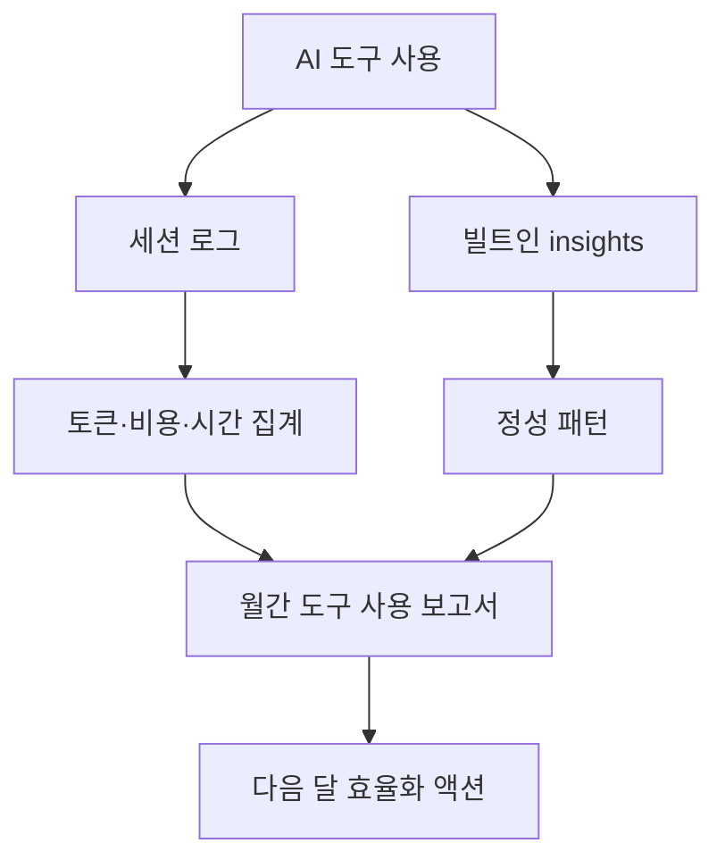

# Claude Monthly Review

> Claude 유료 구독 요금제를 어디에 썼는지 월간 단위로 집계하고 복기하는 공개 사례 모듈입니다.

시간 회계가 워크로그라면, Claude Monthly Review는 AI 도구에 쓴 토큰·비용·세션·시간·프로젝트 분포를 보는 월간 리뷰입니다. 청구서가 아니라 실제 사용 패턴을 기준으로 다음 달의 도구 사용 방식을 조정합니다.

## 월간 복기 지표 한눈에

| 지표 카테고리 | 집계 항목 | 무엇을 보는가 | 이어지는 액션 |
|---|---|---|---|
| 1. 총량 | 토큰·세션·메시지·활성 시간·가동일 수 | 한 달 사용 규모와 가동 밀도 | 사용량 vs 구독료 ROI 환산 |
| 2. 비용 환산 | API 단가 시뮬레이션, 가중 평균 단가, 일 평균 비용 | 정액제가 실제로 몇 배 가치인지 | 구독 유지·다운그레이드 판단 |
| 3. 모델 분포 | 모델별 토큰·메시지·세션·프로젝트 점유율 | 고비용 모델에 얼마나 의존하는가 | 판단형은 고비용, 실행형은 중간 모델로 재배분 |
| 4. 시간대 패턴 | 시간대별 토큰·세션 분포 | 워크 리듬과 야간 클러스터 위치 | 집중 시간대 보호, 비효율 시간대 차단 |
| 5. 프로젝트 분포 | 프로젝트별 토큰 Top N, 단일 최대일 | 어디에 무게가 실렸는가 | 자산화 작업 vs 운영 작업 비중 점검 |
| 6. 업무 카테고리 funnel | 신규 인프라·재고 작업·디버깅·콘텐츠 분류 비중 | 같은 마찰이 반복되는지, 자본화가 진행되는지 | 반복 마찰을 자동화·문서화로 영구 제거 |
| 7. 다음 달 액션 | 효율화 액션 5개 | 측정한 패턴을 어떻게 바꿀 것인가 | 다음 달 보고서에서 실행 여부 검증 |

핵심 원칙은 "정액제는 어디에 쓰는지를 측정하지 않으면 같은 마찰을 매달 반복한다" 하나입니다. 청구서가 없어진 만큼 자기 계측이 의무가 됩니다. 7개 카테고리 모두 측정만 하고 끝나면 가짜 지표입니다. 각 지표는 다음 달의 행동 변화로 이어져야 합니다.

## 핵심 파일

| 항목 | 위치 | 쓰임 |
|---|---|---|
| 월간 리뷰 예시 | [`../../examples/monthly-claude-review/`](../../examples/monthly-claude-review/) | Claude 구독 요금제 사용량을 공개 가능한 형태로 정리한 보고서와 워크플로 |
| 2026-04 보고서 | [`../../examples/monthly-claude-review/2026-04-anonymized.md`](../../examples/monthly-claude-review/2026-04-anonymized.md) | 첫 달 실제 보고서의 공개 가능 버전 |
| Chart 04 PNG | [`../diagrams/04-category-funnel.png`](../diagrams/04-category-funnel.png) | 업무 카테고리별 토큰 비중을 바로 볼 수 있는 대표 이미지 |
| Chart 04 HTML | [`../diagrams/04-category-funnel.html`](../diagrams/04-category-funnel.html) | 대표 PNG를 다시 만들 때 쓰는 공개용 차트 원본 |
| 운영 계측 | [`../operations-telemetry/`](../operations-telemetry/) | 시간 회계와 Claude Monthly Review를 연결하는 기반 |

## 읽는 순서

1. 위 7개 지표 카테고리 표로 보고서가 다루는 범위를 잡습니다.
2. [`../../examples/monthly-claude-review/2026-04-anonymized.md`](../../examples/monthly-claude-review/2026-04-anonymized.md)에서 실제 보고서 구조와 단위 환산 방식을 봅니다.
3. 자기 결제일 기준으로 월간 집계 기간을 정합니다.
4. 빌트인 인사이트와 세션 로그 집계를 1회 수동 실행해, 두 수치의 차이가 왜 생기는지 확인합니다.
5. 다음 달에 줄일 마찰과 유지할 고효율 사용 패턴을 액션 5개로 남깁니다.

## 작성 원칙

- 토큰·시간·USD 같은 구조적 수치는 그대로 공개합니다. 동료가 자기 수치와 비교할 베이스라인이 되도록.
- 프로젝트명·고객명·계약 조건은 공개판에서 일반화합니다. 비공개 SSOT는 별도 저장소에서 관리합니다.
- 정량 분석과 정성 분석을 같은 보고서에 두되, 빌트인 인사이트와 자체 집계의 수치가 다를 때는 차이를 해명합니다.
- 보고서는 한 줄 요약으로 시작하고, 마지막은 다음 달 액션 5개로 닫습니다.

## 다음 행동

월간 보고서가 한 사이클 돌면 [`../principles/`](../principles/)의 원칙 문서와 교차 점검합니다. 토큰 비중이 시급 방어선·플랫폼 집중도·부의 사다리 어느 원칙도 강화하지 않는다면, 다음 달엔 그 카테고리의 사용을 의도적으로 줄입니다. 1인 사업의 도구 회계와 사업 원칙이 분기마다 정합하는지가 이 모듈의 최종 검증 지점입니다.
