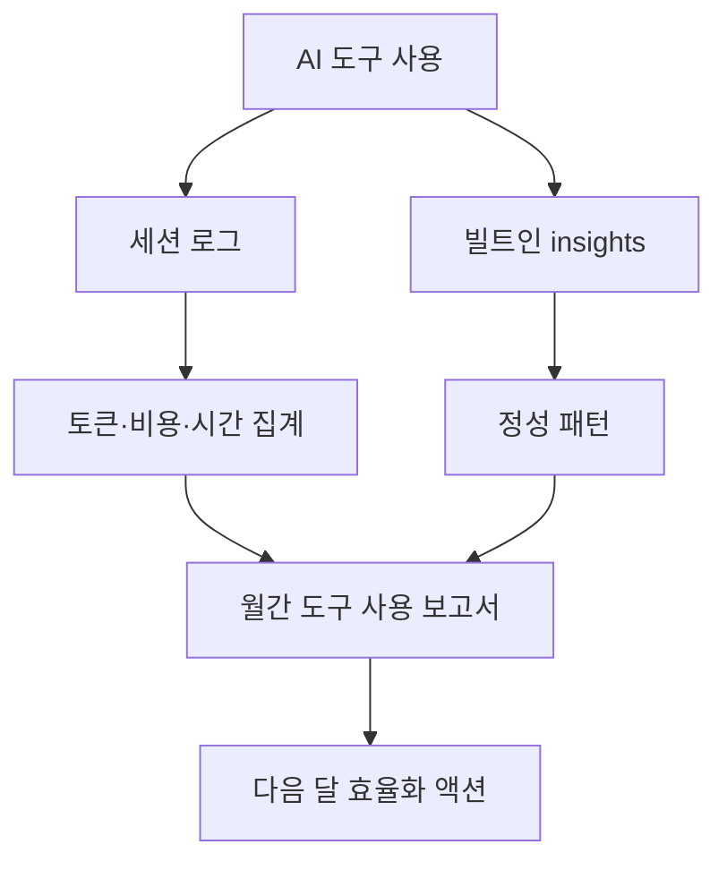

# Claude Monthly Review

> Claude 유료 구독 요금제를 어디에 썼는지 월간 단위로 집계·복기하는 공개 사례입니다.

시간 회계가 워크로그라면, Claude Monthly Review는 AI 도구에 쓴 토큰, 비용, 세션, 시간, 프로젝트 분포를 보는 월간 리뷰입니다. 청구서가 아니라 실제 사용 패턴을 기준으로 다음 달의 도구 사용 방식을 조정합니다.

## 핵심 파일

| 항목 | 위치 | 쓰임 |
|---|---|---|
| 월간 리뷰 예시 | [`../../examples/monthly-claude-review/`](../../examples/monthly-claude-review/) | Claude 구독 요금제 사용량을 공개 가능한 형태로 정리한 보고서와 워크플로 |
| Chart 04 HTML | [`../diagrams/04-category-funnel.html`](../diagrams/04-category-funnel.html) | 대표 PNG를 다시 만들 때 쓰는 공개용 차트 원본 |
| 2026-04 보고서 | [`../../examples/monthly-claude-review/2026-04-anonymized.md`](../../examples/monthly-claude-review/2026-04-anonymized.md) | 첫 달 실제 보고서의 공개 가능 버전 |
| Chart 04 PNG | [`../diagrams/04-category-funnel.png`](../diagrams/04-category-funnel.png) | 업무 카테고리별 토큰 비중을 바로 볼 수 있는 대표 이미지 |
| 운영 계측 | [`../operations-telemetry/`](../operations-telemetry/) | 시간 회계와 Claude Monthly Review를 연결하는 기반 |

## 읽는 순서

1. 이 문서에서 Claude Monthly Review의 위치를 봅니다.
2. [`../../examples/monthly-claude-review/`](../../examples/monthly-claude-review/)에서 보고서 구조와 자동화 흐름을 확인합니다.
3. 자기 결제일 기준으로 월간 집계 기간을 정합니다.
4. 다음 달에 줄일 마찰과 유지할 고효율 사용 패턴을 액션으로 남깁니다.
