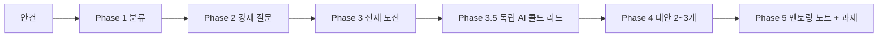

# Office Hours

> 사업 결정을 혼자 내리기 전에, 나를 한 번 심문하는 멘토링 절차입니다.

1인 사업자는 아이디어를 검증해 줄 동료도, 제안을 같이 따져 줄 파트너도 없습니다. 그래서 대부분의 결정이 "일단 해보자"로 흘러가고, 결과가 나온 뒤에야 전제가 틀렸다는 걸 알게 됩니다. Office Hours는 그 공백을 메우기 위해 만든 자가 멘토링 절차입니다. YC 오피스아워의 강제 질문 방식을 1인 사업 맥락으로 옮겨, 만들지 말지·받을지 말지·시간을 넣을지를 결정하기 전에 스스로를 한 번 밀어붙입니다.

이 모듈의 산출물은 코드가 아니라 **멘토링 노트 한 개**입니다. 절차의 핵심은 답을 빨리 주는 것이 아니라, 문제가 제대로 이해됐는지부터 확인하는 것입니다.

GGPLab이 실제 운영에서 신규 아이디어·수주·자산 투자를 판단할 때 쓰는 절차를 공개 가능한 형태로 정리했습니다.

---

## 언제 쓰나

| 안건 유형 | 질문 모드 | 대표 상황 |
|---|---|---|
| 신규 사업/제품 아이디어 | 스타트업 모드 | "이거 만들 만한가?"를 만들기 전에 검증 |
| 수주/제안 판단 | 수주 모드 | 들어온 일을 받을지, 시급 방어선·반복성·재판매 기준으로 |
| 자산 투자 판단 | 스타트업 모드 | 책·강의·콘텐츠 자산에 시간을 넣을지 |
| 도구/자동화 구축 | 빌더 모드 | 내 운영을 위한 빌드를 사거나 안 만드는 것과 비교 |

## 무엇을 얻나

- 편안한 첫 답을 두 번 밀어붙여 얻은, 증거 기반의 진짜 답
- "흥미롭네요" 같은 아첨 대신 입장이 분명한 진단
- 뚜렷이 다른 대안 2~3개와 각각의 공수·리스크·재사용 가능성
- 다음에 할 구체적 행동 하나로 끝나는 멘토링 노트

## 구성

| 문서 | 위치 | 쓰임 |
|---|---|---|
| 절차 | [`method.md`](method.md) | 5단계 멘토링 절차와 강제 질문, 안티-아첨 규칙 |
| 노트 양식 | [`note-template.md`](note-template.md) | 세션 결과를 남기는 빈 멘토링 노트 |

## 다른 모듈과의 연결

Office Hours의 판단 기준은 [`../principles/`](../principles/)의 운영 원칙(시급 방어선·플랫폼 집중도·부의 사다리)을 그대로 빌려 씁니다. 원칙은 "어떤 기준으로 판단하는가"를 정의하고, Office Hours는 "그 기준을 특정 안건에 적용해 결정까지 끌고 가는" 절차입니다.

안건이 [`../strategy-design/`](../strategy-design/)의 린캔버스와 연결되면, 세션은 그 캔버스의 가설을 강제 질문으로 검증하는 자리가 됩니다. 결정의 근거가 되는 시간·비용 수치는 [`../operations-telemetry/`](../operations-telemetry/)와 [`../claude-monthly-review/`](../claude-monthly-review/)의 실측 데이터에 연결합니다.
