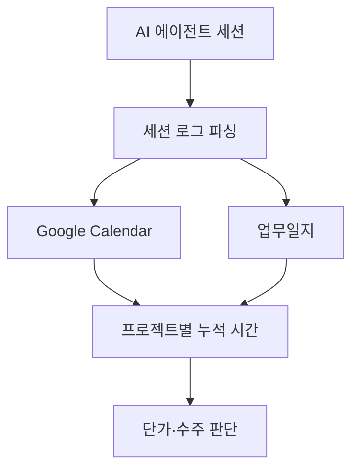

# Operations Telemetry

> AI 에이전트 세션을 캘린더와 업무일지로 자동 적재해, 프로젝트별 투입 시간을 실측하는 모듈입니다.

원칙은 실측 데이터가 있어야 방어됩니다. "시급 N원 밑으로는 안 받는다"를 선언이 아니라 숫자로 말하려면, 프로젝트별 누적 시간을 자동으로 찍어주는 계측이 필요합니다.

## 계측 파이프라인 한눈에

| 단계 | 트리거 | 처리 내용 | 산출물 |
|---|---|---|---|
| 1. Stop hook 발화 | 에이전트 세션 종료 | 세션 ID를 stdin payload에서 추출 | 비동기 후처리 작업 큐잉 |
| 2. 세션 메타 추출 | 세션 `.jsonl` 파일 | 활성 시간·메시지 수·툴·토큰·git 변경량 집계 | 단일 세션 지표 객체 |
| 3. 캘린더 upsert | 세션 ID 기반 idempotent | 같은 프로젝트 30분 이내 이벤트는 자동 머지 | `[프로젝트] 한 줄 제목` 이벤트 |
| 4. 업무일지 append | `<!-- AUTO -->` 마커 사이만 갱신 | 그날 모든 세션을 시간순 합산해 narrative화 | `업무일지/YYYY-MM-DD.md` |
| 5. 분기 회고 입력 | 캘린더 필터로 프로젝트별 누적 시간 추출 | 실투입 시급·플랫폼 비중·자산 시간 환산 | 단가 재협상·수주 판단 근거 |

핵심 설계 원칙은 "지표 추출과 출력부 분리" 하나입니다. 캘린더와 업무일지가 같은 세션 메타를 공유해야 나중에 KPI 대시보드를 붙일 때 숫자가 어긋나지 않습니다. 짧은 throwaway 세션(5분 미만 + 커밋 0 + 메시지 3개 미만)은 자동으로 skip합니다.

## 핵심 파일

| 항목 | 위치 | 쓰임 |
|---|---|---|
| 구현 예시 | [`../../automation/claude-worklog/`](../../automation/claude-worklog/) | 세션 종료 시 캘린더·업무일지에 자동 기록하는 Stop hook 시스템 |
| 구조도 PNG | [`../diagrams/worklog-architecture.png`](../diagrams/worklog-architecture.png) | README에서 바로 보이는 구조도 |
| 구조도 HTML | [`../diagrams/worklog-architecture.html`](../diagrams/worklog-architecture.html) | 문서나 발표 자료에 재사용할 수 있는 인터랙티브 버전 |
| 관련 원칙 | [`../principles/01-pricing-floor.md`](../principles/01-pricing-floor.md) | 실측 시간을 단가 방어선에 연결하는 기준 |

## 읽는 순서

1. 위 5단계 표와 구조도로 전체 흐름의 형태를 잡습니다.
2. [`../../automation/claude-worklog/`](../../automation/claude-worklog/)에서 설치와 스크립트 구조, dry-run 명령을 확인합니다.
3. 첫 실행 후 1주일치를 백필해 캘린더에 이벤트가 정상으로 적재되는지 검증합니다.
4. [`../principles/01-pricing-floor.md`](../principles/01-pricing-floor.md)와 연결해 분기 회고에서 단가 방어선의 근거 자료로 씁니다.

## 운영 원칙

- 자동화는 수동 메모를 덮지 않습니다. 업무일지의 `<!-- AUTO -->` 마커 바깥은 항상 보존합니다.
- 같은 세션 ID로 재실행해도 이벤트가 중복되지 않도록 idempotent upsert를 유지합니다.
- 세션 제목 생성에 LLM을 쓰더라도, 머지와 백필 때는 호출하지 않습니다. 제목이 흔들리고 비용만 늘어납니다.
- 캘린더 대신 다른 도구(Notion·구독 캘린더·CRM)로 옮기고 싶다면 출력부 함수 하나만 교체합니다. 지표 추출부는 그대로 재사용 가능합니다.

## 다음 행동

계측이 정상 작동하면 [`../claude-monthly-review/`](../claude-monthly-review/)로 이동해, 누적된 세션 데이터를 월 단위로 집계하고 도구 사용 패턴을 복기합니다. 시간 회계(워크로그)와 도구 회계(월간 리뷰)가 합쳐져야 사업 의사결정 대시보드가 완성됩니다.
