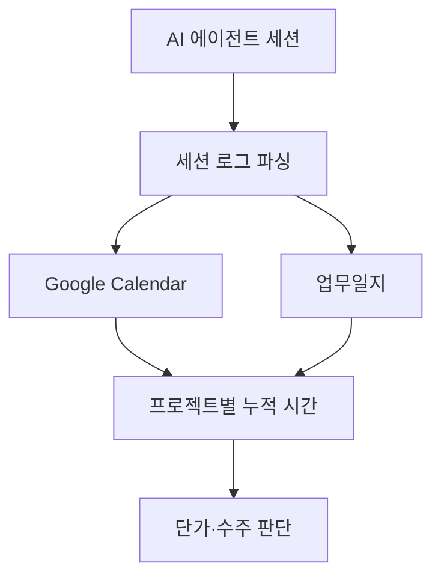

# Operations Telemetry

> AI 에이전트 세션을 캘린더·업무일지로 남겨 프로젝트별 투입 시간을 실측하는 모듈입니다.

원칙은 실측 데이터가 있어야 방어됩니다. "시급 N원 밑으로 안 받는다"를 선언이 아니라 숫자로 말하려면, 프로젝트별 누적 시간을 자동으로 찍어주는 계측이 필요합니다.

## 핵심 파일

| 항목 | 위치 | 쓰임 |
|---|---|---|
| 구현 예시 | [`../../automation/claude-worklog/`](../../automation/claude-worklog/) | 세션 종료 시 캘린더·업무일지에 자동 기록하는 Stop hook 시스템 |
| 구조도 PNG | [`../diagrams/worklog-architecture.png`](../diagrams/worklog-architecture.png) | README에서 바로 보이는 구조도 |
| 구조도 HTML | [`../diagrams/worklog-architecture.html`](../diagrams/worklog-architecture.html) | 문서나 발표 자료에 재사용할 수 있는 HTML 버전 |
| 관련 원칙 | [`../principles/01-pricing-floor.md`](../principles/01-pricing-floor.md) | 실측 시간을 단가 방어선에 연결하는 기준 |

## 읽는 순서

1. 이 문서에서 전체 흐름을 봅니다.
2. [`../../automation/claude-worklog/`](../../automation/claude-worklog/)에서 설치와 스크립트 구조를 확인합니다.
3. [`../principles/01-pricing-floor.md`](../principles/01-pricing-floor.md)와 연결해 분기 회고 기준으로 씁니다.
