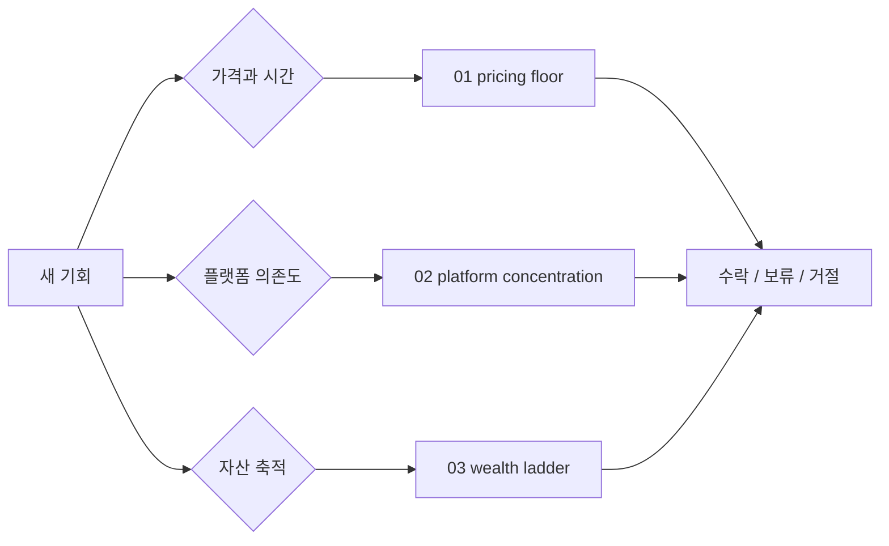

# Principles

> 매번 새로 고민하지 않기 위해 만든 1인 사업 운영 원칙 모음입니다.

원칙 문서는 선언문이 아니라 반복 의사결정에 쓰는 체크리스트입니다. 제안, 플랫폼, 가격, 시간 배분을 판단할 때 같은 기준으로 다시 볼 수 있게 만듭니다.

## 원칙 목록

| 원칙 | 위치 | 핵심 질문 |
|---|---|---|
| 시급 방어선 | [`01-pricing-floor.md`](01-pricing-floor.md) | 이 일이 최소 시간당 기준을 지키는가? |
| 플랫폼 집중도 | [`02-platform-concentration.md`](02-platform-concentration.md) | 특정 플랫폼 하나에 과도하게 의존하고 있지 않은가? |
| 부의 사다리 | [`03-wealth-ladder.md`](03-wealth-ladder.md) | 이 일이 일회성 노동인지, 재사용 가능한 자산인지 구분했는가? |

## 작성 규칙

- 원칙은 짧게 쓰고, 판단 기준은 구체적으로 씁니다.
- 실제 고객명, 금액, 계약 조건은 공개 가능한 범위로 일반화합니다.
- 원칙을 뒷받침하는 수치는 워크로그나 월간 리뷰처럼 별도 계측 자료에 연결합니다.
