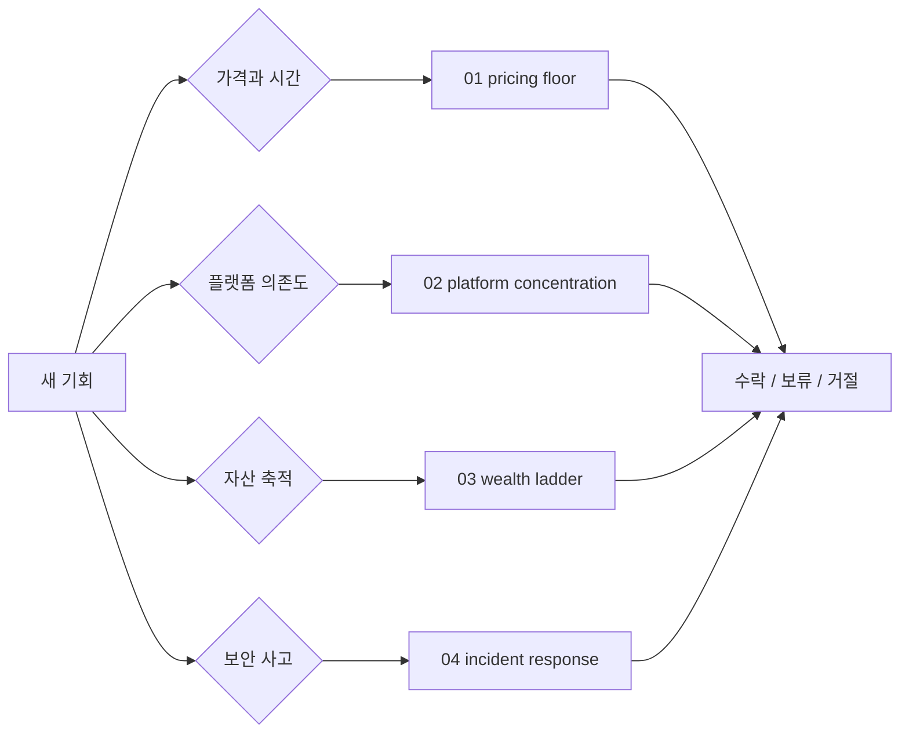

# Principles

> 매번 새로 고민하지 않기 위해 만든 1인 사업 운영 원칙 모음입니다.

원칙 문서는 선언문이 아니라 반복 의사결정에 쓰는 체크리스트입니다. 제안, 플랫폼, 가격, 시간 배분, 보안 사고를 판단할 때 같은 기준으로 다시 볼 수 있게 만듭니다.

## 원칙 목록

| 원칙 | 위치 | 핵심 질문 |
|---|---|---|
| 시급 방어선 | [`01-pricing-floor.md`](01-pricing-floor.md) | 이 일이 최소 시간당 기준을 지키는가? |
| 플랫폼 집중도 | [`02-platform-concentration.md`](02-platform-concentration.md) | 특정 플랫폼 하나에 과도하게 의존하고 있지 않은가? |
| 부의 사다리 | [`03-wealth-ladder.md`](03-wealth-ladder.md) | 이 일이 일회성 노동인지, 재사용 가능한 자산인지 구분했는가? |
| 보안 사고 대응 | [`04-security-incident-response.md`](04-security-incident-response.md) | 공급망 공격·자격증명 침해를 1차 소스로 검증하고 blast radius 순으로 대응하는가? |

## 원칙 4개 한눈에

| 원칙 | 트리거 상황 | 판단 기준 | 산출 액션 |
|---|---|---|---|
| 시급 방어선 | 새 제안·견적·수주 요청이 들어왔을 때 | 실투입 시간 환산 시급이 사전 방어선 미만인가 | 미만이면 정중 거절, 초과면 수락, 경계면 전략 보너스로 재평가 |
| 플랫폼 집중도 | 분기 매출 비중을 집계할 때 또는 단일 채널에서 큰 제안이 들어왔을 때 | 한 플랫폼·고객사 비중이 분기 평균 40%를 넘는가 | 35~40% 모니터링, 40~50% 신규 수주 게이트 조임, 50%+ 의존 해소 최우선 |
| 부의 사다리 | 상품 라인업·시간 배분을 설계할 때 | 매출이 시간교환·서비스·자산·시스템 중 어느 단에 몰려 있는가 | 자산(3단) 비중을 1년 25% → 2년 40% → 3년 55% 로드맵으로 끌어올림 |
| 보안 사고 대응 | 공급망 공격 뉴스·watchdog 알림·의심 점검 도구 지시를 받았을 때 | 1차 소스 2곳 이상에서 IoC가 교차 검증되는가 | Detect → Triage → Contain → Eradicate → Recover → Learn 순서 준수, 증거 없는 토큰 전면 회전 금지 |

원칙은 짧게 쓰고, 판단 기준은 구체적으로 씁니다. 4개 모두 "감정이 아니라 숫자로" 판단하기 위한 장치입니다.

## 작성 규칙

- 원칙은 한 줄 정의 → 왜 중요한가 → 계산법·체크리스트 → 흔한 반론 → 다른 직군 적용 순서로 씁니다.
- 실제 고객명, 금액, 계약 조건은 공개 가능한 범위로 일반화합니다.
- 원칙을 뒷받침하는 수치는 워크로그·월간 리뷰처럼 별도 계측 자료에 연결합니다.
- 새 원칙은 같은 의사결정이 분기 안에 3회 이상 반복돼 패턴이 보일 때만 추가합니다.

## 다음 행동

원칙이 작동하려면 실측 데이터가 필요합니다. [`../operations-telemetry/`](../operations-telemetry/)에서 프로젝트별 누적 시간을 자동으로 찍는 계측 구조를 잡고, [`../claude-monthly-review/`](../claude-monthly-review/)에서 도구 사용 비중을 월 단위로 봅니다. 원칙 4개는 그 데이터 위에서만 방어 가능합니다.
