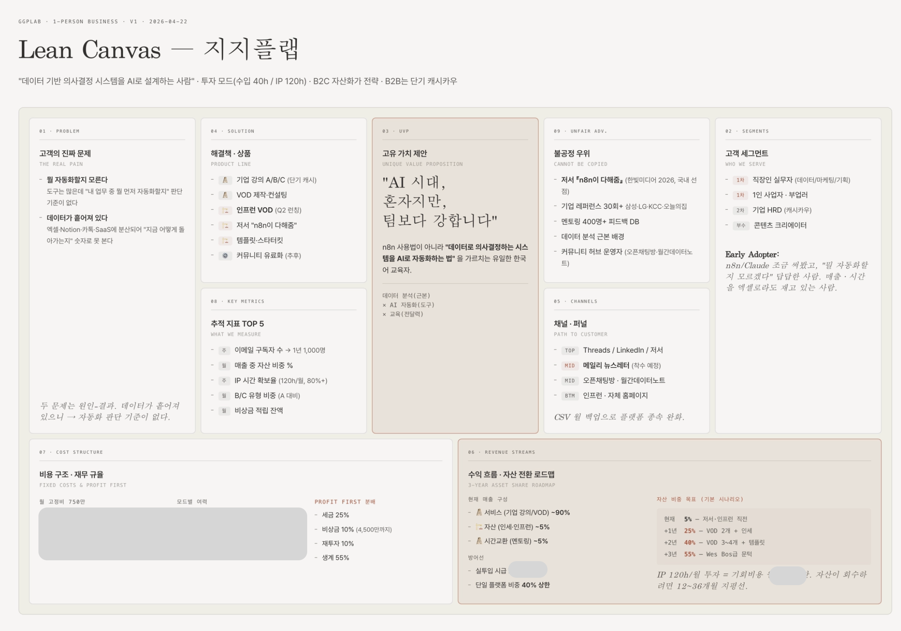
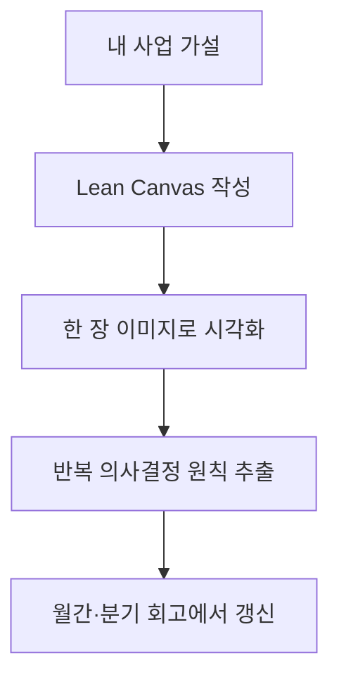

# Strategy Design

> 실제 사례와 빈 템플릿으로 자기 사업의 고객, 문제, 수익 구조를 정리하는 모듈입니다.

린캔버스는 스타터킷의 첫 모듈입니다. 실제 사례로 감을 잡고, 빈 템플릿에 자기 사업을 투영한 뒤, 결과를 한 장 이미지로 시각화해 전략 드리프트를 점검합니다.

## 핵심 파일

| 항목 | 위치 | 쓰임 |
|---|---|---|
| 실제 사례 | [`../../examples/my-canvas.md`](../../examples/my-canvas.md) | 공개 가능한 형태로 익명화한 린캔버스 완성본 |
| 이미지 버전 | [`../../examples/my-canvas.png`](../../examples/my-canvas.png) | 미팅, 공유 글, 회고 때 한눈에 보는 캔버스 |
| 빈 템플릿 | [`../../template/lean-canvas.md`](../../template/lean-canvas.md) | 독자가 복사해서 자기 사업에 맞게 작성 |
| 의사결정 원칙 | [`../principles/`](../principles/) | 캔버스에서 반복해서 나오는 판단 기준을 분리 |

## 읽는 순서

1. [`../../examples/my-canvas.md`](../../examples/my-canvas.md)로 완성본의 밀도를 봅니다.
2. [`../../template/lean-canvas.md`](../../template/lean-canvas.md)를 복사해 현재 가설을 채웁니다.
3. 반복 판단 기준은 [`../principles/`](../principles/)에 원칙으로 분리합니다.
4. 분기마다 이미지 버전을 다시 만들어 전략 드리프트를 점검합니다.
