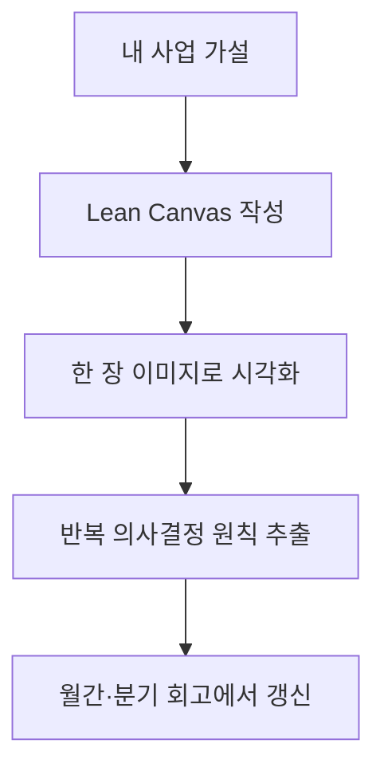

# Strategy Design

> 실제 사례와 빈 템플릿으로 자기 사업의 고객, 문제, 수익 구조를 한 장에 정리하는 모듈입니다.

린캔버스는 스타터킷의 첫 모듈입니다. 실제 사례로 감을 잡고, 빈 템플릿에 자기 사업을 투영한 뒤, 결과를 한 장 이미지로 시각화해 전략 드리프트를 분기마다 점검합니다.

## 린캔버스 9블록 한눈에

| # | 블록 | 한 줄 정의 | 자기 사업 적용 질문 |
|---|---|---|---|
| 1 | Problem | 고객이 실제로 겪는 상위 2~3개 고통 | 고객이 지금 이 문제를 어떤 우회책으로 버티고 있나? |
| 2 | Customer Segments | Early Adopter 한 사람으로 묘사 가능한 세그먼트 | 이 세그먼트의 "이미 하고 있는 행동" 하나를 꼽을 수 있나? |
| 3 | Unique Value Proposition | 도구 이름 빼고 결과로 쓴 한 문장 | 형용사 없이 명사·동사만으로 쓸 수 있나? |
| 4 | Solution | 문제당 상위 3가지 해결 기능 | 각 솔루션이 1번 Problem과 1:1 매핑되는가? |
| 5 | Channels | TOP(발견)·MID(관계)·BOTTOM(전환) 세 층 | 지금 비어 있는 층은 어디인가? |
| 6 | Revenue Streams | 가격 모델과 비중 구조 | 단일 수익원이 총 매출의 40%를 넘지 않는가? |
| 7 | Cost Structure | 월 고정비와 비상금 목표 | 매출 0인 달에도 몇 개월 버틸 수 있나? |
| 8 | Key Metrics | 행동으로 바뀌는 선행·후행 지표 3~5개 | 이 지표가 빨간불일 때 무엇을 할 것인가? |
| 9 | Unfair Advantage | 3개월 안에 카피 불가능한 자산 | 살 수 있는 것은 빼고 남는가? |

핵심 원칙은 "절대 매출이 아니라 비중과 사다리 단계로 관리한다" 하나입니다. 캔버스는 한 번 채우는 게 아니라, 분기마다 다시 그려서 가설이 어디서 빗나갔는지 확인하는 작업판입니다.

## 핵심 파일

| 항목 | 위치 | 쓰임 |
|---|---|---|
| 실제 사례 | [`../../examples/my-canvas.md`](../../examples/my-canvas.md) | 공개 가능한 형태로 익명화한 린캔버스 완성본 |
| 이미지 버전 | [`../../examples/my-canvas.png`](../../examples/my-canvas.png) | 미팅, 공유 글, 회고 때 한눈에 보는 캔버스 |
| 빈 템플릿 | [`../../template/lean-canvas.md`](../../template/lean-canvas.md) | 독자가 복사해서 자기 사업에 맞게 작성 |
| 의사결정 원칙 | [`../principles/`](../principles/) | 캔버스에서 반복해서 나오는 판단 기준을 분리 |

## 읽는 순서

1. 위 9블록 표로 전체 블록의 형태를 먼저 잡습니다.
2. [`../../examples/my-canvas.md`](../../examples/my-canvas.md)로 완성본의 밀도를 봅니다.
3. [`../../template/lean-canvas.md`](../../template/lean-canvas.md)를 복사해 현재 가설을 채웁니다.
4. 반복 판단 기준은 [`../principles/`](../principles/)에 원칙으로 분리합니다.
5. 분기마다 이미지 버전을 다시 만들어 전략 드리프트를 점검합니다.

## 작성 규칙

- 블록 작성은 1 → 2 → 4 → 3 → 9 → 5 → 8 → 6 → 7 순서를 권장합니다. UVP와 Channels는 다른 블록이 채워진 뒤가 정확합니다.
- 절대 금액은 빈 템플릿이 아닌 사적 SSOT에 두고, 공개판에는 비중과 배수만 남깁니다.
- 분기 회고마다 변경 이력을 짧게 적습니다. 캔버스는 결과물보다 의사결정 로그로 쓸 때 더 강합니다.

## 다음 행동

캔버스 v1이 닫히면 [`../principles/`](../principles/)로 이동해, 캔버스에서 반복해서 등장하는 판단 기준(시급 방어선·플랫폼 집중도·부의 사다리)을 별도 원칙 문서로 분리합니다. 운영 계측은 [`../operations-telemetry/`](../operations-telemetry/), 도구 사용 복기는 [`../claude-monthly-review/`](../claude-monthly-review/)에서 이어집니다.
