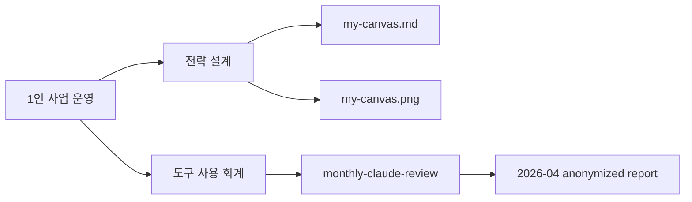

# Examples

> 실제 운영에서 사용한 자료를 공개 가능한 형태로 익명화한 예시 모음입니다.

루트 README는 전체 지도이고, 이 디렉토리는 "실제로 어떻게 생겼는지"를 보여주는 공유용 진입점입니다. Threads나 블로그 글에서는 저장소 메인보다 아래 항목 중 하나를 직접 링크하는 편이 찾기 쉽습니다.

## 예시 목록

| 예시 | 위치 | 언제 보면 좋은가 |
|---|---|---|
| 린캔버스 공개판 | [`my-canvas.md`](my-canvas.md), [`my-canvas.png`](my-canvas.png) | 1인 사업의 고객, 문제, 수익 구조를 한 장으로 정리하고 싶을 때 |
| 월간 Claude 사용 복기 | [`monthly-claude-review/`](monthly-claude-review/) | 정액제 AI 도구를 어디에 썼는지 토큰, 비용, 시간 기준으로 회고하고 싶을 때 |

## 공개 원칙

- 고객명, 내부 프로젝트명, 실제 계약 조건은 일반화합니다.
- 절대 금액, 식별 가능한 경로, 실제 계정 정보는 제거하거나 마스킹합니다.
- 구조적 수치와 판단 기준은 가능한 한 남겨서 독자가 자기 상황과 비교할 수 있게 합니다.
