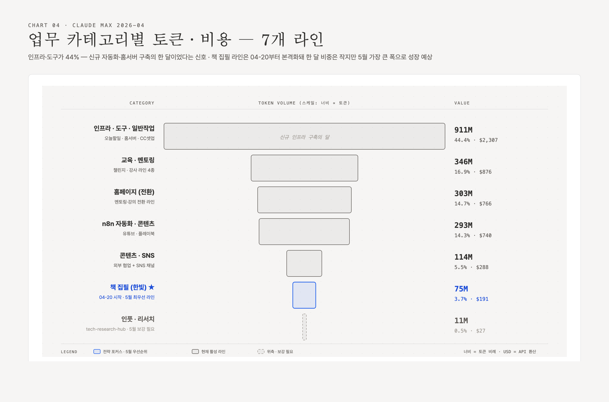
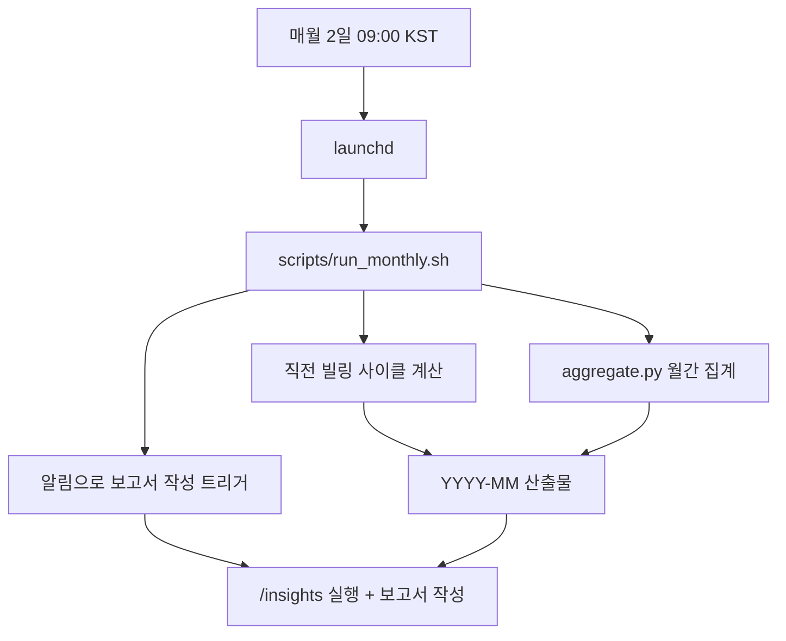

# Monthly Claude Review — 1인 사업자의 Claude 구독 요금제 사용 복기

> **목적**: Claude 유료 구독 요금제를 쓰는 1인 사업자가 _내가 한 달 동안 Claude를 어디에 어떻게 썼는지_ 정량·정성으로 복기하기 위한 워크플로우와 보고서 템플릿.

자기 사업의 _시간 회계_가 워크로그라면, 이 모듈은 _Claude Monthly Review_다. 결제일(매월 2일) 기준으로 직전 한 달을 돌아본다.




---

## 왜 만들었나

- Claude 구독 요금제는 정액제라 "내가 얼마치 썼는가"를 청구서로 알 수 없다.
- 그러나 토큰·세션·시간·프로젝트 분포는 _어디에 무게가 실렸는지_를 정확히 보여준다.
- 단순 사용량이 아니라 **"무엇이 새로 인프라화됐는가, 어디서 마찰이 반복됐는가, 다음 달엔 어떻게 다르게 쓸 것인가"** 를 도출하는 게 목적.

---

## 사용 방법

1. **`/insights` 실행** (Claude Code 빌트인) — 빌트인 자체 분석 결과를 받는다.
2. **JSONL 집계 스크립트** — `~/.claude/projects/` 의 모든 세션 transcript를 KST 기준 월간 윈도우로 집계해 CSV/JSON 산출.
3. **모델별 가격 적용** — Anthropic 표시 단가 환산해 USD 비용 추정 (구독 ROI 계산).
4. **보고서 작성** — 정량 + 정성 + 인사이트 + 다음 달 액션 5단으로 구성.
5. **자동화** — 매월 2일 09시 launchd가 ①~③을 자동 실행, Discord 알림으로 보고서 작성을 트리거.

---

## 산출물 예시

- [`2026-04-anonymized.md`](2026-04-anonymized.md) — 첫 달 (2026-04-02 ~ 2026-05-01) 익명화 보고서.
- 이 폴더의 모든 보고서는 프로젝트명·고객명·금액 등 식별 정보를 마스킹한 _공개 가능 버전_이다. 원본은 별도 비공개 저장소에서 관리한다.

---

## 보고서 표준 구조 (템플릿)

```
0. 한 줄 요약 — 한 달 핵심 수치(토큰·비용·세션·시간) + 패턴 한 줄
시각화 인덱스 (5종 차트 링크)

1. 정량 핵심 지표
  1-1. 합계 (토큰·세션·메시지·시간·가동일)
  1-2. API 환산 비용 + ROI + 단위 환산 (외주 환산 등)
  1-3. 모델 분포
  1-4. 시간대 패턴 (KST 0-23)
  1-5. 일자별 Top + 무작업일

2. 프로젝트·업무 카테고리 분석
  2-1. 카테고리별 토큰 합계
  2-2. 프로젝트 Top N 상세
  2-3. (home) 또는 미분류 버킷 해부

3. /insights 정성 분석 (빌트인 결과 핵심 발췌)

4. JSONL vs /insights 수치 차이 해명

5. 한 달 회고 — 가장 큰 사건, 정량의 그림자(왜 그렇게 많은 토큰이?)

6. 인사이트 + 다음 달 액션 5
```

---

## 핵심 메트릭 정의

| 지표 | 정의 |
|------|------|
| `total_tokens` | input + output + cache_creation + cache_read |
| `active_minutes` | 세션 내 인접 메시지 gap ≤ 5분 구간만 합산 (5분 초과는 idle 처리) |
| `cost_usd` | 모델별 토큰 × Anthropic 표시 단가 (cache 5m TTL = 1.25× input 가정) |
| `subscription_roi` | `api_equivalent_cost_usd / monthly_subscription_fee_usd` — 구독료 대비 실제 사용 가치 배수 |
| `weighted_per_M` | `total_cost_usd / (total_tokens / 1M)` — 가중평균 단가 |

---

## 자동화 구조



---

## 1인 사업자에게 왜 의미 있나

- **시간 회계 + 도구 회계 결합**: 워크로그(시간) + 본 보고서(도구 사용)가 합쳐지면 "어디에 시간을 썼고, 그 시간에 AI를 어떻게 활용했고, 그래서 무엇이 인프라화됐는지" 한 화면에 보인다.
- **정액제의 함정 회피**: 정액제는 "쓸수록 이득"이 맞지만, _어디에 쓰는지를 측정하지 않으면_ 같은 마찰을 매달 반복하게 된다. (대표 사례: 인증 만료 디버깅 6회/월)
- **모델 선택의 가시화**: Opus만 쓰는 습관 → 토큰의 95%가 Opus → "Sonnet으로 옮겼다면 얼마 절감이었을까"를 매월 본다.
- **신규 인프라 vs 재고 작업 분리**: 한 달 토큰의 어느 정도가 _영구 자산_(자동화·문서·시스템)에 들어갔는지가 사업의 자본화 속도다.

---

## 라이선스 / 익명화 원칙

- 보고서에 등장하는 프로젝트명·고객명·계약 조건·드라이브 ID 등은 모두 일반화 또는 마스킹.
- 토큰 수·시간·비용 같은 _구조적 수치_는 그대로 공개 — 1인 사업자 동료가 자기 수치와 비교할 수 있는 베이스라인이 되도록.
- 본인 신상이 추정되는 단서(특정 출판사·강의 플랫폼명)는 "출판사 A", "강의 플랫폼 B" 식으로 일반화.
