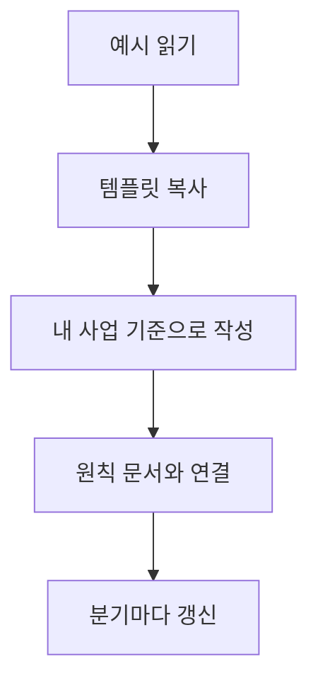

# Templates

> 독자가 복사해서 자기 사업에 맞게 채울 수 있는 빈 양식 모음입니다.

이 디렉토리는 예시를 읽은 뒤 바로 실행으로 옮기는 단계입니다. 완성본은 공개하지 않아도 되며, 개인 노트나 비공개 저장소에서 유지해도 됩니다.

## 템플릿 목록

| 템플릿 | 위치 | 용도 |
|---|---|---|
| Lean Canvas | [`lean-canvas.md`](lean-canvas.md) | 고객, 문제, 해법, 수익 구조, 비용 구조, 핵심 지표를 한 장으로 정리 |

## 추천 사용법

1. [`lean-canvas.md`](lean-canvas.md)를 복사합니다.
2. 처음에는 빈칸을 완벽히 채우려 하지 말고 현재 가설을 적습니다.
3. 반복해서 나오는 판단 기준은 [`docs/principles/`](../docs/principles/)에 원칙으로 분리합니다.
4. 월간 또는 분기 회고 때 실제 매출, 시간, 프로젝트 데이터를 반영해 갱신합니다.
